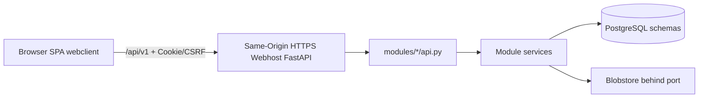

# AP-029 — Web-/PostgreSQL-Zielarchitektur und Übergang

Status: Active transition governance (P1)
Valid from: 2026-08-21
Canonical index: `docs/DOCS_CANONICAL_INDEX.md`
Steering companion: `docs/MASTER_ORCHESTRATION_ROADMAP.md`

## 1. Statuskopf

### Ziel und Geltungsbereich

Dieses Dokument ist das **verbindliche Steuerungsdokument** für den Übergang von der
historischen Desktop-/SQLite-Ist-Architektur zur produktiven Zielarchitektur
**Webclient + FastAPI-Transport + Modul-Services + PostgreSQL + Blobstore**.

GOV00 (dieses Paket) schreibt Architekturentscheidungen und den ausführbaren Checkpoint-Plan
kanonisch fest. GOV00 implementiert **keinen** Webclient, **keine** PostgreSQL-Migration,
**keinen** Container-Produktionspfad und **kein** Deployment.

### Abgrenzung: entschieden / geplant / implementiert

| Kategorie | Bedeutung |
| --- | --- |
| **DECIDED** | Verbindliche Zielentscheidung; neue Arbeit darf nicht widersprechen |
| **PLANNED** | Checkpoint im Ledger; noch nicht begonnen, außer der Current checkpoint |
| **IMPLEMENTED** | Nur, wenn ein Checkpoint `PASS` ist und Evidence vorliegt |

Technisch grüne Gates ersetzen **keine** menschliche Pilotfreigabe (`PILOT01`) und
keine formale Acceptance außerhalb des jeweils freigegebenen Pakets.

### P0-Verweise

- `docs/GUI_SOURCE_OF_TRUTH.md`
- `docs/GUI_ARCHITECTURE_PROJECT.md`
- `docs/MODULE_INTEGRATION_POLICY.md`
- `docs/MODULES_DEVELOPER_GUIDE.md`
- `docs/ARCHITECTURE_REFACTOR_CANONICAL.md`
- `docs/DATABASE_EVOLUTION_POLICY.md`
- `docs/OPERATIONS_CANONICAL.md`
- `docs/TEST_SMOKE_GATES.md`
- `docs/DOCS_CANONICAL_INDEX.md`

Historische J04-M0-Acceptance bleibt unverändert und ist **nicht** Gegenstand von AP-029.

---

## 2. Verbindliches Entscheidungsregister

Alle Einträge unten haben Status **DECIDED**.

### D01 — Neue Endbenutzeroberfläche

- **Entscheidung:** Einzige neue UI-Source-of-Truth ist `webclient/` (Vue 3 + TypeScript,
  Vite, Vuetify hinter einer QM-eigenen Komponentenschicht) als zentrale SPA.
  Fachmodule liefern keine eigenen Frontend-Bundles.
- **Begründung:** Eine zentrale Shell vermeidet parallele Fach-UIs und hält Domainwahrheit
  in Services.
- **Konsequenz:** Neue Produkt-UI-Arbeit erfolgt erst ab WEB00 und nur unter `webclient/`.
- **Ausgeschlossen:** Modul-eigene SPA-Bundles; parallele neue Desktop-UI; Behauptung, WEB00
  sei bereits implementiert.

### D02 — PyQt/Tk eingefroren

- **Entscheidung:** PyQt und Tk sind frozen Legacy/Reference. Keine weitere Produktentwicklung,
  kein zukünftiger Pilotbetrieb, keine neuen PyQt-Contributions.
- **Begründung:** Desktop-Pfad bleibt Referenz für historische Regression und J04-M0-Historie,
  ist aber nicht die Ziel-UI.
- **Konsequenz:** Historische PyQt-Dokumentation darf bleiben, muss aber als Legacy/History
  gekennzeichnet sein. Bis WEB00 existiert kein neuer produktiver Endbenutzerclient.
- **Ausgeschlossen:** Neue PyQt-Produktfeatures; PyQt als Pilotclient; parallele
  Fachworkflows in PyQt und Web.

### D03 — Persistenz PostgreSQL-only

- **Entscheidung:** Produktive Runtime ist ausschließlich PostgreSQL. Kein produktiver SQLite-Fallback.
  Eine PostgreSQL-Datenbank je Installation; getrenntes Schema,
  Migrationen und Ownership je Modul; keine direkten Cross-Schema-Abfragen zwischen
  Fachmodulen.
- **Begründung:** Multiuser-/On-Prem-Betrieb und klare Modulgrenzen erfordern ein
  gemeinsames relationales Fundament ohne Fallback-Drift.
- **Konsequenz:** SQLite nur für read-only Inventar, einmaligen Import und isolierte Tests.
- **Ausgeschlossen:** Produktiver SQLite-Fallback; Big-Bang-Shared-Schema über Module hinweg;
  Cross-Schema-SQL zwischen Fachmodulen.

### D04 — Organisation / Mandant

- **Entscheidung:** Hosted-ready Single-Organisation: genau eine aktive Organisation in der
  ersten On-Prem-Installation. `organization_id` kommt aus serverseitigem Kontext, nicht
  autoritativ aus Browserdaten. Neue Persistenz-, Audit-, Event- und Blob-Verträge sind
  organisationsbezogen. Keine Multi-Tenant-Administration im ersten Pilot.
- **Begründung:** Mandantenfähigkeit vorbereiten, ohne Pilotkomplexität zu erhöhen.
- **Konsequenz:** Services und HTTP-Rand müssen bestätigte Organisation im Serverkontext führen.
- **Ausgeschlossen:** Browser-gelieferte autoritative `organization_id`; Multi-Tenant-Admin
  im ersten Pilot.

### D05 — Browser- und HTTP-Vertrag

- **Entscheidung:** Same-Origin HTTPS; serverseitige opake PostgreSQL-Sessions;
  HttpOnly-/Secure-/angemessenes SameSite-Cookie; CSRF-Schutz für zustandsändernde
  Browserrequests; kein Sessiontoken in `localStorage`/`sessionStorage`. `/api/v1` ist die
  kanonische HTTP-Grenze. Unversionierte Routen werden nach atomarer Migration aller
  internen Clients und Tests entfernt — kein dauerhafter Compatibility-Adapter.
  `modules/<name>/api.py` bleibt die öffentliche Python-Grenze.
- **Begründung:** Browser-Sicherheit und klare Transportgrenze ohne Doppel-APIs.
- **Konsequenz:** WEB00 und Folgepakete implementieren Cookie/CSRF und `/api/v1`.
- **Ausgeschlossen:** JWT-in-Storage als Sessionmodell; dauerhafte Dual-Route-Adapter;
  Businesslogik im Transport.

### D06 — Web-Modulmodell

- **Entscheidung:** Zentrale SPA besitzt Shell, Router, Theme, i18n, Auth, Connection State
  und Komponenten. Module liefern versionierte Datenverträge, Capabilities und
  `allowed_actions`. Autorisierung bleibt in der Serviceschicht. Generic-first
  (List/Detail/Form/History); Custom Views nur für echte Spezialabläufe (z. B. PDF-Viewer,
  Signaturplatzierung). Keine Fachlogik im Browser.
- **Begründung:** Wiederverwendbare UI-Muster und stabile Servicewahrheit.
- **Konsequenz:** WEB01 baut Documents/Signature auf Generic-Views plus gezielte Custom Views.
- **Ausgeschlossen:** Fachregeln in Vue-Komponenten; Modul-Frontend-Bundles.

### D07 — Audit

- **Entscheidung:** Append-only fachliche Auditquelle in PostgreSQL mit Actor,
  `organization_id`, Request-/Correlation-Kontext, Zeitpunkt, Objekt und Aktion.
  Technische Logs bleiben separat und sind nicht die fachliche Nachweisquelle.
  Keine Geheimnisse, Passwörter, Sessiontokens oder privaten Schlüssel in Audit/Logs.
- **Begründung:** Nachweisbarkeit und Trennung von Betriebsdiagnose.
- **Konsequenz:** PG00 definiert den Auditvertrag; Pilot verlangt nachweisbaren Auditpfad.
- **Ausgeschlossen:** Audit nur als Datei-JSONL als alleinige Nachweisquelle in der Zielruntime;
  Secrets in Auditzeilen.

### D08 — Artefakte / Blobstore

- **Entscheidung:** PostgreSQL hält Metadaten; Dateien liegen in einem allein vom Backend
  verwalteten Blobstore. Erste Implementierung darf ein verwaltetes Server-Dateisystem
  hinter einem Port sein. Zugriff nur über opake Artifact-IDs. Checksums, Größe, Medientyp,
  Owner/Organisation und Version werden persistiert. Keine Serverpfade im Browser.
  PostgreSQL und Blobstore benötigen einen gemeinsamen Backup-/Restore-Vertrag.
- **Begründung:** Pfadisolation, Integrität und gemeinsame Wiederherstellung.
- **Konsequenz:** OPS00 und PG00 spezifizieren den gemeinsamen Backup-Set-Vertrag.
- **Ausgeschlossen:** Browser-sichtbare Serverpfade; getrennte Backups ohne gemeinsamen Vertrag.

### D09 — Erstes Deployment

- **Entscheidung:** Windows Server zuerst; zentraler On-Prem-Server; Browserclients im LAN
  über HTTPS; Backend als kontrollierter Dienst; kontrollierte Releases statt
  In-App-Auto-Update. Wartungsmodus, Preflight, vollständiges Backup, Migration, Healthcheck.
  Bei irreversibler Migration kein Down-Migration-Fallback; Rollback = Restore des
  vollständigen Backup-Sets.
- **Begründung:** Kontrollierter Betrieb und sichere Rückkehrpunkte.
- **Konsequenz:** OPS00 implementiert Dienst-/Update-/Restore-Verträge; PILOT00 verlangt
  Restore-Drill.
- **Ausgeschlossen:** In-App-Auto-Update als Produktivmodell; Down-Migrationen als Rollback.

### D10 — Datenexport

- **Entscheidung:** Technisches Backup ≠ Nutzerdatenexport. Portabilitätsexport: Admin-ZIP
  mit Manifest, Checksums, maschinenlesbaren Daten und freigegebenen Artefakten.
  Separater lesbarer Audit-/Nachweisexport. Keine Schlüssel, Passwort-Hashes oder sonstigen
  Geheimnisse exportieren.
- **Begründung:** Compliance und Portabilität ohne Secret-Leckage.
- **Konsequenz:** OPS00 trennt Backup, Portabilitätsexport und Nachweisexport.
- **Ausgeschlossen:** Backup-ZIP als Nutzerdatenexport ausgeben; Secrets im Export.

### D11 — Erster Echtdaten-Pilot

- **Entscheidung:** Begrenzte Nutzer und Dokumente; vollständiger DMS-Kern (Login, minimale
  Nutzerverwaltung, Documents, Rollen/`allowed_actions`, ETag/If-Match, Kommentare,
  bestehende QM-Signatur mit Passwort-Reauthentifizierung, unveränderliches freigegebenes PDF,
  PDF-Viewer, Freigabe, Audit, Restart/Persistenz). PDF-first. DOCX/DOTX-Quellen dürfen
  gespeichert werden; produktive Konvertierung bleibt hinter Converter-Port und wird in
  CONV00 separat gehärtet. Keine Behauptung einer qualifizierten elektronischen Signatur.
- **Begründung:** Früher nutzbarer Kern ohne Converter- und Signaturrecht-Überversprechen.
- **Konsequenz:** PILOT00/PILOT01 sind menschliche Gates; CONV00 und J04-M1 verzögern den
  Pilot nicht.
- **Ausgeschlossen:** QES-Behauptungen; Pilot ohne Restore-/Security-Readiness.

### D12 — Container-Prototyp

- **Entscheidung:** Später nur portablen Domain-/API-/Testkern übernehmen; kein SQLite-Wiring;
  keine statische Demo-UI; keine automatische Migration/Aktivierung beim normalen Backendstart;
  J04-M0-Backendpfad darf nicht regressieren. Container-Produktivierung erst nach
  Web-/PostgreSQL-Fundament.
- **Begründung:** Nützliche Portabilität ohne Bootstrap-Regression oder Scheinproduktisierung.
- **Konsequenz:** CB00 ist eng begrenzt und verändert keine zentralen Runtimepfade produktiv.
- **Ausgeschlossen:** Container ersetzt J04-Bootstrap; Demo-UI als Produktclient;
  Auto-Activation beim Backendstart.

### D13 — Gated Macro Execution

- **Entscheidung:** Ein ausdrücklich freigegebenes Makro darf mehrere Checkpoints seriell
  orchestrieren. Jeder Checkpoint behält eine separate Allowlist, separate Evidence, einen
  separaten Reviewer-Verdict und einen separaten lokalen Commit. Nach dem ersten unresolved
  Checkpoint stoppt das gesamte Makro. Pro Checkpoint sind höchstens zwei normale
  Remediation-Runden und danach genau ein frischer Escalation Review zulässig.
- **Begründung:** Größere Arbeitsabschnitte sollen ohne dauernde Interaktion ausführbar sein,
  ohne Scope-, Evidence- oder Commitgrenzen aufzuweichen.
- **Konsequenz:** Ein Makro ist eine Autorisierungshülle, kein gemeinsamer Implementierungsdiff.
  Push, PR, Review-Auflösung, Merge, Deployment, Echtdaten und Human Gates bleiben separat.
- **Ausgeschlossen:** mehrere Checkpoints in einem Diff oder Commit; stilles Weiterarbeiten nach
  Rot/Blocked; eine dritte normale automatische Reparaturrunde.

### D14 — Container-Qualifikation vor Übernahme

- **Entscheidung:** CB00 qualifiziert den historischen Container-Prototyp auf Commit- und
  Komponentenebene. Code wird nur selektiv extrahiert, wenn er ohne SQLite, konkretes SQL,
  Runtime-Aktivierung sowie konkurrierende Audit-/Signatur-/Artifact-Verantwortung portabel ist.
  Ein dokumentierter No-Code-PASS ist zulässig. CB01 produktiviert Container erst nach dem
  bewiesenen DMS-Webmuster.
- **Begründung:** Der Prototyp-Service ist an SQLite und direkte SQL-Ausführung gekoppelt; ein
  unveränderter Merge würde D03 und die aktuelle J04-Baseline verletzen.
- **Konsequenz:** CB00 ist keine Cherry-pick- oder Merge-Anweisung. Der historische Branch bleibt
  Referenz, wenn kein verantwortbarer Slice existiert.
- **Ausgeschlossen:** Import von `sqlite_repository.py`, SQLite-Migrationen, Demo-UIs,
  Demo-Routen, Bootstrap-/Packaging-Aktivierung oder SQL-gekoppeltem Servicecode.

### D15 — Reviewer model evidence profiles

- **Entscheidung:** Der native Checkpoint-Reviewer (`checkpoint-reviewer`) klassifiziert
  Modellnachweise in genau drei Evidenzprofile:
  1. **RUNTIME_ATTESTED** — tatsächlich dienendes Modell und Reasoning/Modellvariante sind aus
     Cursor-Laufzeitmetadaten beobachtet und stimmen mit der geforderten Konfiguration überein.
  2. **CONTROL_PLANE_PINNED** — nur für lokale native Cursor-Subagents, wenn vollständig belegt:
     tatsächliche Instanziierung des projektgebundenen Custom-Agents; eindeutige Agent-ID;
     separater Agentenkontext; Frontmatter exakt `gpt-5.6-terra`; Task-Auftrag beginnt mit
     `[ROLE:checkpoint-reviewer]`; keine Cursor-Meldung über Fallback, Inheritance,
     Substitution oder Modellabweichung; keine verfügbaren Metadaten widersprechen der
     Konfiguration; Reviewer verwendet `$verify-reports-and-plan`; Reviewer ist read-only;
     Pre-/Post-Fingerprint identisch; `observed_runtime_model` und `observed_reasoning` werden
     bei Nichtverfügbarkeit ausdrücklich als `UNAVAILABLE` berichtet. Unter diesem Profil darf
     niemals behauptet werden, das Laufzeitmodell sei beobachtet oder runtime-attestiert.
  3. **UNVERIFIED** — fehlende oder widersprüchliche Frontmatter-/Task-/Agent-ID-/Kontext-/
     Mutationsnachweise, **oder genau ein verfügbares Runtime-Feld** (`partial runtime metadata`)
     → Reviewer-Gate `FAIL`, kein Commit, Makro stoppt beziehungsweise eskaliert nach dem
     ausgeschöpften normalen Rework-Budget.
- **Begründung:** Lokale Cursor-Subagents stellen oft keine unabhängigen Laufzeitmodell-Metadaten
  bereit (R23). Ohne ehrliche Evidenzstufen entstehen falsche Runtime-Attestierungen oder unnötige
  Dauer-BLOCKED-Zustände trotz nachweisbarer Control-Plane-Bindung.
- **Konsequenz:** Beide Runtime-Felder beobachtet und übereinstimmend → `RUNTIME_ATTESTED`.
  Genau ein Feld beobachtet → `UNVERIFIED`/`BLOCKED` (`partial runtime metadata`). Beobachtete
  Abweichung bei beiden Feldern → immer `BLOCKED` — niemals auf `CONTROL_PLANE_PINNED`
  zurückfallen. Beide Felder unavailable und `CONTROL_PLANE_PINNED` vollständig nachgewiesen →
  fachlicher Review darf fortgesetzt werden.
- **Ausgeschlossen:** Frontmatter allein als Runtime-Beweis; `UNAVAILABLE` in einen beobachteten
  Modellwert umdeuten; `CONTROL_PLANE_PINNED` als `RUNTIME_ATTESTED` bezeichnen; partielle
  Runtime-Metadaten als Pin akzeptieren; fachlichen Review wegen fehlender optionaler lokaler
  Runtime-Metadaten abbrechen, obwohl `CONTROL_PLANE_PINNED` vollständig belegt ist.

---

## 3. Zielarchitektur

Textuelle Erklärung:

1. Der Browser spricht ausschließlich Same-Origin `/api/v1` an; keine direkten DB- oder
   Dateipfade.
2. Der FastAPI-Host ist Transport: Serialisierung, Session-Cookie, CSRF, Request-Kontext.
3. Fachliche Use Cases laufen über öffentliche Modul-APIs in Services.
4. Services erzwingen Autorisierung, Invarianten, `organization_id` und Audit-Kontext.
5. Persistenz ist PostgreSQL (Metadaten) plus Blobstore (Binärdaten).
6. Keine Businesslogik in Backendtransport oder SPA.

UserContext / `organization_id` / Audit-Kontext stammen aus serverseitig bestätigtem
Session-/Request-Kontext.

---

## 4. Checkpoint-Ledger

<!-- AP029_LEDGER_START -->
Current checkpoint: PG00

| ID | Title | Status | Start SHA | Ergebnis/Evidence | Notes |
| --- | --- | --- | --- | --- | --- |
| GOV00 | Canonical architecture decisions and executable plan | PASS | d39c8e798d8c9bdf77b721c9cfa76001c2a676d5 | build/ap-029-gov00/ baseline 9 passed; gate-a 4 passed; gate-b 13 passed; gate-c 13 passed; gate-d 19 passed; junit under build/ap-029-gov00/*/junit.xml | this package |
| GOV01 | Executable macro governance and ledger hardening | PASS | d39c8e798d8c9bdf77b721c9cfa76001c2a676d5 | R5 PASS build/ap-029-gov01/r5-20260821T133945364Z/ gate-a 19 passed; gate-b 15 passed; gate-c 37 passed; Gate E PASS CONTROL_PLANE_PINNED agent 5e997705-3943-4833-9889-fe6ec6a85228 | historical R1–R4 preserved; Current advances to TOOL00 |
| TOOL00 | Native Cursor reviewer and gated macro tooling | PASS | 62520ad2de0f5444b6eb59e82569fcea280e7b17 | R1 PASS build/ap-029-tool00/r1-20260821T135155594Z/ gate-a 17 passed; gate-b 15 passed; gate-c 38 passed; Gate E PASS CONTROL_PLANE_PINNED agent b442ad1b-0311-483f-9102-7f7ea5d295dd; attempt0 REMEDIATION_REQUIRED preserved | remediation 1/1; Current advances to CB00 |
| CB00 | Controlled portable container-core integration | PASS | 2ad03e7090822a9f5237b6c6ba19fd43faa94415 | R1 No-Code-PASS build/ap-029-cb00/r1-20260822T091700065Z/ gate-a 18 passed; gate-b 16 passed; gate-c 40 passed; Gate E attempt1 PASS CONTROL_PLANE_PINNED agent 8c211263-6e86-469c-99c7-07f90f64c03e; 53/53 disposition | no code import; Current advances to INV00 |
| INV00 | Read-only SQLite store inventory | PASS | 3484d6df6f3d814ce657352a60066d0adf57623c | R1 build/ap-029-inv00/r1-20260822T104500000Z/ gate-a 18 passed; gate-b 16 passed; gate-c 40 passed; Gate E attempt1 PASS CONTROL_PLANE_PINNED agent cf156ee0-1976-47ca-8668-bdc6eae6401e; 7 stores classified | read-only; Current advances to PG00 |
| PG00 | PostgreSQL platform foundation | IN_PROGRESS | 90cefa498d05f708ad54d4d673a41e245957d63f | PG00-A PASS dd91ec4 / platform gate 12 passed + static 10 passed; PG00-B open | roles, schemas, runner, org, audit, blob contracts |
| WEB00 | webclient foundation and /api/v1 cookie/CSRF shell | TODO | — | — | Vue/TS foundation; not yet implemented as of GOV00 |
| PG01 | Documents/Registry/Signature PostgreSQL migration | TODO | — | — | preserve existing domain behavior |
| OPS00 | Windows service, HTTPS, backup/restore, export | TODO | — | — | shared PG+blob backup contract |
| INT00 | Joint integration gate PG00/WEB00/PG01/OPS00 | TODO | — | — | blocks WEB01 |
| WEB01 | Full Documents/Signature web workflow | TODO | — | — | after INT00 |
| PILOT00 | Pilot readiness security/restore/ops/human-smoke | TODO | — | — | blocks live data |
| PILOT01 | Limited live-data pilot with human approval | TODO | — | — | human gate |
| CB01 | Container productization after proven DMS web pattern | TODO | — | — | not a pilot blocker; PostgreSQL and central web patterns only |
| CONV00 | DOCX/DOTX converter comparison and hardening | TODO | — | — | after or parallel post-pilot selection |
| J04-M1 | Relational domain normalization after pilot | TODO | — | — | must not delay pilot |
| MOD00 | Further modules on same backend/PG/web pattern | TODO | — | — | after pattern proven |
<!-- AP029_LEDGER_END -->

Allowed ledger statuses: `TODO`, `IN_PROGRESS`, `PASS`, `FAILED`, `BLOCKED`.

After successful GOV00: GOV00=`PASS`, Current checkpoint=`GOV01`, later checkpoints remain `TODO`.
No later work may be described as started or completed by GOV00 alone.

---

## 5. Abhängigkeiten und Makroausführung

- **GOV00** vor allem; **GOV01** repariert den ausführbaren Vorwärtsvertrag.
- **TOOL00** ist vor jedem Produktcheckpoint verpflichtend.
- **CB00** und **INV00** sind eng begrenzt und dürfen keine zentralen Runtimepfade verändern.
- **PG00** ist Plattformvoraussetzung für produktive Persistenzverträge.
- Die verbindliche Standardintegration ist strikt seriell. Separate Branches oder parallele
  Analyse sind nur nach einer späteren ausdrücklichen Steuerungsentscheidung zulässig und dürfen
  weder Ledger-Reihenfolge noch Current-checkpoint-Semantik umgehen.
- Zentrale Composition-/Bootstrap-Dateien nur in kurzen seriellen Integrationsfenstern.
- **INT00** blockiert **WEB01**, bis PG00/WEB00/PG01/OPS00 gemeinsam grün sind.
- **PILOT00** blockiert Echtdaten.
- **J04-M1** darf den Pilot nicht verzögern.
- **CB01** folgt erst nach dem bewiesenen DMS-Webmuster und blockiert PILOT01 nicht.
- Folgepakete sind **nicht** automatisch freigegeben. Ein ausdrücklich freigegebenes Makro darf
  die benannten Checkpoints jedoch ohne weitere Nutzerinteraktion seriell abarbeiten, wenn jeder
  Checkpoint einen eigenen PASS, Evidence, Reviewer-Verdict und lokalen Commit erreicht.

### Makrogruppen

| Makro | Checkpoints | Ziel |
| --- | --- | --- |
| M0 Governance | GOV01 → TOOL00 | belastbarer Ledger und nativer Reviewer |
| M1 Container/Inventar | CB00 → INV00 | Prototyp qualifiziert; SQLite-Stores disponiert |
| M2 PostgreSQL-Fundament | PG00 | Migration, Organisation, Audit, Blob-Vertrag |
| M3 Web-Fundament | WEB00 | zentrale Web-Shell und sicherer HTTP-Rand |
| M4 DMS-Persistenz | PG01 | Documents/Registry/Signature auf PostgreSQL |
| M5 Betrieb | OPS00 | Dienst, HTTPS, Backup/Restore, Update, Export |
| M6 DMS-Webslice | INT00 → WEB01 | integrierter Browserworkflow |
| M7 Pilotbereitschaft | PILOT00 | Security, Restore, Betrieb und Human-Smoke |

Ein Makro setzt keine Berechtigung für destruktive PostgreSQL-Läufe, Human Gates, Echtdaten,
Push, PR, Review-Auflösung, Merge oder Deployment voraus. Diese Aktionen bleiben zielgenau und
separat freizugeben.

---

## 6. Checkpoint-Spezifikationen

### GOV00 — Canonical architecture decisions and executable plan

- **Ziel:** Widersprüchliche Architekturverträge durch konsistenten Ziel-/Übergangsplan ersetzen.
- **Erlaubter Scope:** Nur die Allowlist-Dateien dieses Auftrags (Docs + Docs-Konsistenztests).
- **Ausschlüsse:** Produktcode, Webclient-Implementierung, PostgreSQL-Schemas, Container-Übernahme,
  Commit/Push/PR/Deployment.
- **Vorbedingungen:** Sauberer Worktree auf erwartetem `main`-SHA; Baseline docs-consistency grün.
- **Schritte:** AP-029 anlegen; P0/Entry/Roadmap angleichen; Konsistenztests erweitern; Gates A–D.
- **Fokussierte Tests:** `tests/docs/test_docs_consistency.py` (AP-029-/Web-/Postgres-Filter).
- **Breitere Gates:** vollständige `tests/docs/test_docs_consistency.py`, dann `tests/docs`.
- **Fail-fast:** Erstes rotes Pflichtgate stoppt; GOV00 bleibt nicht PASS.
- **Definition of Done:** Entscheidungen, Ledger, P0-Konsistenz, Gates A–D grün, Staging leer.
- **Evidence:** JUnit unter `build/ap-029-gov00/`.
- **Statusübergang:** IN_PROGRESS → PASS → Current=`GOV01`.
- **Separat freizugeben:** Commit, Push, PR, GOV01-Start.

### GOV01 — Executable macro governance and ledger hardening

- **Ziel:** Ledger, Evidence-Pfade und Makrovertrag so härten, dass spätere Checkpoints ohne
  GOV00-Sonderannahmen fortgeschrieben werden können.
- **Erlaubter Scope:** AP-029, Master-Roadmap, Agent-Workflow-Regel und Docs-Vertragstests.
- **Ausschlüsse:** Produktcode, Webclient, Persistenz, Runtime-Wiring, Container-Übernahme.
- **Vorbedingungen:** GOV00 PASS; GOV00-JUnit-Evidence unverändert vorhanden.
- **Schritte:** checkpoint-spezifische Evidence-Wurzeln; serielle Semantik; D13/D14; Risiken;
  vollständige Checkpoint-Spezifikationen; alle GOV00-Bestätigungsläufe nachtragen.
- **Gates:** fokussierte AP-029-Verträge; vollständige Docs-Konsistenz; `tests/docs`;
  Allowlist und `git diff --check`; unabhängiger Review.
- **Fail-fast:** erster roter/blocked Schritt stoppt die Sequenz; maximal R1 und R2, danach genau
  ein Escalation Review.
- **DoD:** ein hypothetischer späterer PASS kann seine eigene Evidence-Wurzel verwenden;
  Roadmap und Ledger nennen denselben Current checkpoint; Makrogrenzen sind testgeschützt.
- **Evidence:** `build/ap-029-gov01/` mit allen Versuchen und Diff-Snapshot.
- **Statusübergang:** TODO → IN_PROGRESS → PASS|FAILED|BLOCKED; bei PASS Current=`TOOL00`.

### TOOL00 — Native Cursor reviewer and gated macro tooling

- **Ziel:** Einen projektgebundenen, unabhängigen Cursor-Reviewer und einen wiederverwendbaren
  fail-fast Makro-Skill bereitstellen.
- **Erlaubter Scope:** `.cursor/agents/checkpoint-reviewer.md`,
  `.cursor/skills/execute-gated-macro/`, zugehörige Contracttests und Ledger-Evidence.
- **Ausschlüsse:** externer Review-Wrapper, Produktcode, Runtime, Push/PR/Merge.
- **Vorbedingungen:** GOV01 PASS; installierte Cursor-Version erkennt projektgebundene Agents.
- **Schritte:** Reviewer mit `$verify-reports-and-plan`; Terra-Bindung;
  Orchestrierungs-Skill; Snapshot-/Verdict-Vertrag; echter nativer Reviewer-Smoke.
- **Gates:** Agent-/Skill-Contracttests; vollständige Docs-Gates; Diff-Hash vor/nach Review;
  nativer Reviewer-Verdict.
- **Fail-fast:** Wenn die konfigurierte Terra-Bindung fehlt, Cursor eine Modellabweichung meldet
  oder D15 nur `UNVERIFIED` ergibt, ist TOOL00=`BLOCKED`. Kein anderer Agent darf als
  gleichwertiger Ersatz ausgegeben werden.
- **DoD:** Reviewer liefert PASS oder FAIL, verändert keine getrackte Datei und weist
  seine Modellbindung nach; Makro-Skill erzwingt höchstens zwei Reworks und getrennte Commits.
- **Evidence:** `build/ap-029-tool00/`.
- **Statusübergang:** TODO → IN_PROGRESS → PASS|FAILED|BLOCKED; bei PASS Current=`CB00`.
- **Publikationsbedingung:** CB00 beginnt erst, wenn Governance und TOOL00 in `origin/main`
  enthalten sind.

### CB00 — Controlled portable container-core integration

- **Ziel:** Portablen Domain-/API-/Testkern kontrolliert integrieren.
- **Erlaubter Scope:** Nur explizit freigegebene portable Kernteile; Tests; Docs-Hinweise.
- **Ausschlüsse:** SQLite-Wiring, Demo-UI, Runtime-Auto-Activation, J04-Bootstrap-Regression,
  Produktiv-Containerisierung.
- **Vorbedingungen:** GOV00 PASS.
- **Schritte:** Inventar des Prototyps; Diff gegen J04-Pfad; SQL-/SQLite-/Ownership-Prüfung;
  selektive Extraktion nur bei erfülltem Portabilitätsvertrag; andernfalls No-Code-Disposition.
- **Fokussierte Tests:** betroffene Backend-/Modul-/Boundary-Tests.
- **Breitere Gates:** platform/modules/e2e laut Auftrag.
- **Fail-fast:** erste Regression am J04-Pfad stoppt.
- **DoD:** Jeder Prototypteil ist übernehmen/archivieren/verwerfen/CB01 zugeordnet. Ein
  übernommener Kern ist ohne SQLite/Demo/Auto-Activation und J04 bleibt grün. Wenn kein Slice
  die Kriterien erfüllt, ist ein reviewter dokumentierter No-Code-PASS zulässig.
- **Evidence:** Auftragsspezifische `build/ap-029-cb00/`.
- **Statusübergang:** TODO → IN_PROGRESS → PASS|FAILED|BLOCKED.
- **Separat:** Merge, weiteres Paket.

### INV00 — Read-only SQLite store inventory

- **Ziel:** Alle SQLite-Stores inventarisieren; je Store migrate/archive/discard-or-restart.
- **Erlaubter Scope:** Read-only Analyse, Inventardokument, Klassifikation.
- **Ausschlüsse:** Datenmutation, produktiver Cutover, Schemaänderung.
- **Vorbedingungen:** CB00 PASS; ausschließlich read-only Analyse.
- **Schritte:** Store-Liste; Ownership; Fingerprint; Entscheidungsvorschlag.
- **Tests:** Docs-/Inventar-Konsistenz falls vorhanden; keine Mutationsgates.
- **Breitere Gates:** n/a außer Review.
- **Fail-fast:** jede Schreiboperation ist Verstoß.
- **DoD:** vollständige Store-Matrix mit Disposition.
- **Evidence:** Inventarartefakt unter `build/` oder freigegebenem Docs-Pfad.
- **Separat:** tatsächliche Migration (PG01+).

### PG00 — PostgreSQL platform foundation

- **Ziel:** Rollen, Schema-Ownership, Migration Runner, Organization Context, Auditvertrag,
  Blobstore-Vertrag.
- **Erlaubter Scope:** Plattformfundament und Verträge; keine vollständige Fachmodul-Migration.
- **Ausschlüsse:** produktiver SQLite-Fallback; Cross-Schema-SQL; WEB01-Fach-UI.
- **Vorbedingungen:** TOOL00, CB00 und INV00 PASS; Governance-Basis in `origin/main`.
- **Interne Subcheckpoints:** (A) Runner/Rollen/Ownership/Lock/Fingerprint; (B) bestätigter
  `organization_id`-/Request-Kontext; (C) append-only Audit ohne Secrets; (D) Blob-Metadaten,
  Integrität und gemeinsame Backup-Set-ID. Jeder Subcheckpoint erhält eigenen Diff, Evidence,
  Reviewer-Verdict und lokalen Commit.
- **Tests:** Platform-Migration/Readiness; Rollen/Privilege-Negativpfade; Org-Spoofing;
  Audit-Redaction/Append-only; Blob-Checksum/Traversal; Contracttests.
- **Breitere Gates:** `tests/platform`, betroffene Module/Backendtests und kontrollierter
  PostgreSQL-Live-Gate nur mit separater Ziel-/Reset-Freigabe.
- **Fail-fast:** fehlende Ownership/Lock/Fingerprint blockiert.
- **DoD:** Alle vier Subcheckpoints PASS; keine generische Abstraktion allein wegen einer
  Usermanagement-Implementierung; Verträge sind testbar und dokumentiert.
- **Evidence:** `build/ap-029-pg00/` mit Subcheckpoint-Unterverzeichnissen.
- **Statusübergang:** TODO → IN_PROGRESS → PASS|FAILED|BLOCKED; bei PASS Current=`WEB00`.
- **Separat:** PG01 Datenübernahme.

### WEB00 — webclient foundation

- **Ziel:** `webclient/` Foundation (Vue/TS/Vite), `/api/v1`, Cookie/CSRF, Shell, typed client.
- **Erlaubter Scope:** Foundation only; noch kein voller DMS-Webworkflow.
- **Ausschlüsse:** Fachlogik im Browser; Modul-Bundles; Behauptung voller Produktreife.
- **Vorbedingungen:** stabile HTTP-/Session-Verträge aus PG00/Auth-Rand.
- **Schritte:** npm-Lockfile und reproduzierbare Node-Version; Scaffold; Shell; Auth-/Connection
  State; relative `/api/v1`-URLs; OpenAPI-basierter TypeScript-Vertrag; schmaler Fetch-Adapter;
  Cookie-/CSRF-Pfad; Fehlerdarstellung.
- **Tests:** Vitest-/Komponentenverträge, Storage-Negativtest, CSRF/HTTP-Verträge und echter
  Browser-Smoke gegen eine kontrollierte Backend-Testinstanz.
- **Breitere Gates:** Web-Gates, Backend-/OpenAPI-Contract und Docs.
- **Fail-fast:** Token-in-Storage oder fehlendes CSRF stoppt.
- **DoD:** Foundation läuft gegen `/api/v1` Same-Origin; keine Fachmodule-UI-Vollständigkeit nötig.
- **Evidence:** `build/ap-029-web00/`.
- **Statusübergang:** TODO → IN_PROGRESS → PASS|FAILED|BLOCKED; bei PASS Current=`PG01`.
- **Hinweis:** WEB00 ist mit Stand GOV00 **nicht implementiert**.

### PG01 — Documents/Registry/Signature → PostgreSQL

- **Ziel:** Bestehendes fachliches Verhalten beibehalten; Persistenz auf PostgreSQL.
- **Erlaubter Scope:** Modul-eigene Repository-/Migrationsadapter, read-only Import und
  erforderliche öffentliche Verträge ohne UI-Vollständigkeit.
- **Ausschlüsse:** relationale Normalisierung à la J04-M1; Web-UI-Vollständigkeit.
- **Vorbedingungen:** PG00 und WEB00 PASS; INV00-Disposition für alle betroffenen Stores.
- **Interne Subcheckpoints:** (A) Schemas/Repository-Verträge; (B) Registry; (C) Documents
  inklusive Workflow/Kommentare/ETags; (D) Signature-Metadaten und geschützte Assets;
  (E) read-only SQLite-Import, Restart, Parallelzugriff und Cutover-Rehearsal.
- **Invarianten:** kein Dual-Write; kein produktiver SQLite-Fallback; Quell-SQLite unverändert;
  Import idempotent oder sicher fortsetzbar; IDs/ETags/Status/Kommentare/Audit nachweisbar;
  Binärdaten nur im Backend-Blobstore; Runtime ohne bereites PostgreSQL fail-closed.
- **Tests:** Repository-Contracttests, Migration/Fingerprint, Importzählungen/Checksums,
  Autorisierung/CAS, Restart/Concurrency und realprocess PostgreSQL.
- **Fail-fast:** Verhaltensregression, Source-Mutation, Ownership-Bruch oder Fallback stoppt.
- **DoD:** Alle Subcheckpoints PASS; Domain-Verhalten und Persistenz/Restart grün; kein produktiver
  SQLite-Open im Zielpfad.
- **Evidence:** `build/ap-029-pg01/`.
- **Statusübergang:** TODO → IN_PROGRESS → PASS|FAILED|BLOCKED; bei PASS Current=`OPS00`.

### OPS00 — Operations foundation

- **Ziel:** Windows-Service, HTTPS, Backup/Restore (PG+Blob), Update/Rollback, Datenexport-Trennung.
- **Erlaubter Scope:** Betriebshost, Installations-/Dienstkonfiguration, Operator-Werkzeuge und
  dokumentierte Drills; keine neue Fachlogik.
- **Ausschlüsse:** In-App-Auto-Update; Down-Migration als Rollback.
- **Vorbedingungen:** PG00 und PG01 PASS; Backup-Set-Vertrag stabil.
- **Interne Subcheckpoints:** (A) Windows-Dienst/Konfiguration/Secrets; (B) HTTPS-/Proxyvertrag;
  (C) konsistentes PG+Blob-Backup und echter Restore-Drill; (D) Wartungsmodus, Update und
  Restore-Rollback; (E) getrennte Portabilitäts-/Nachweisexporte; (F) Health/Readiness/Logs.
- **Tests:** Dienst-Lifecycle soweit automatisierbar; Zertifikat-/Secret-Negativpfade;
  Backup-/Restore-Integrität; Update-Abbruch; Export-Redaction; Operator-Smoke.
- **Fail-fast:** unvollständiges Backup-Set, fehlender Restore-Nachweis oder Secret-Leak stoppt.
- **DoD:** Alle Subcheckpoints PASS; Restore-Drill erfolgreich; Runbooks und Diagnosebundle vorhanden.
- **Evidence:** `build/ap-029-ops00/`.
- **Statusübergang:** TODO → IN_PROGRESS → PASS|FAILED|BLOCKED; bei PASS Current=`INT00`.

### INT00 — Joint integration gate

- **Ziel:** PG00/WEB00/PG01/OPS00 gemeinsam grün.
- **Ausschlüsse:** WEB01 vor INT00; Pilot-Echtdaten.
- **Vorbedingungen:** Alle vier Elterncheckpoints PASS auf derselben integrierten Basis.
- **Gates:** frische gemeinsame Regression; HTTP/OpenAPI; realprocess PostgreSQL; Browser-Login;
  Restart/Persistenz; Backup-Set-Referenz; Diff-/Evidence-Kohärenz.
- **Fail-fast:** erste Versions-, Vertrags- oder Runtimeabweichung stoppt WEB01.
- **DoD:** gemeinsames Evidence-Bundle; Current → WEB01 nur nach PASS.
- **Evidence:** `build/ap-029-int00/`.
- **Statusübergang:** TODO → IN_PROGRESS → PASS|FAILED|BLOCKED; bei PASS Current=`WEB01`.

### WEB01 — Documents/Signature web workflow

- **Ziel:** Vollständiger DMS-Webslice gemäß D11 (ohne Converter-Härtung CONV00).
- **Vorbedingungen:** INT00 PASS.
- **Ausschlüsse:** QES; Multi-Tenant-Admin; weitere Module außer freigegebenem Scope.
- **Interne Slices:** Login/minimale Nutzerverwaltung; Dokumentliste/-detail; PDF-/DOCX-Import;
  Rollen/`allowed_actions`; ETag/If-Match; PDF-/DOCX-Kommentare; Signatur-Reauthentifizierung;
  unveränderliches freigegebenes PDF; PDF-Viewer; Restart/Session; Audit/History.
- **Tests:** Komponenten-/Contracttests, Browser-E2E mit zwei Actor-Sessions, Konflikt-/404-/403-
  Pfade, Artifact-Checksum, Kommentartrennung, Signature-Assets, Restart.
- **Fail-fast:** Fachlogik im Browser, clientseitige Autorisierung als Quelle oder fehlender
  Signatur-/ETag-Negativpfad stoppt.
- **DoD:** vollständiger synthetischer Browser-Realprocess bis APPROVED inklusive Restart.
- **Evidence:** `build/ap-029-web01/`.
- **Statusübergang:** TODO → IN_PROGRESS → PASS|FAILED|BLOCKED; bei PASS Current=`PILOT00`.

### PILOT00 — Pilot readiness

- **Ziel:** Security, Restore, Deployment, Migration, Betrieb, Human-Smoke.
- **Ausschlüsse:** Echtdaten ohne menschliche Freigabe.
- **Vorbedingungen:** WEB01 PASS; produktionsnahe, aber isolierte Zielumgebung.
- **Gates:** Threat-/Security-Review; Restore-Drill; Cutover-Dry-run; Dienst/HTTPS;
  Browser-Human-Smoke; Operator-Runbook; Monitoring/Diagnose; Lizenz-/Deploymentprüfung.
- **Fail-fast:** erster technischer oder menschlicher Pflichtfehler stoppt; kein Echtdatenlauf.
- **DoD:** Readiness-Checkliste grün; blockiert PILOT01.
- **Evidence:** `build/ap-029-pilot00/`.
- **Statusübergang:** TODO → IN_PROGRESS → PASS|FAILED|BLOCKED; bei PASS Current=`PILOT01`.

### PILOT01 — Limited live-data pilot

- **Ziel:** Begrenzter Echtdaten-Pilot.
- **Vorbedingungen:** PILOT00 PASS + explizite menschliche Freigabe.
- **Ausschlüsse:** automatische Freigabe aus technischen Gates; unbegrenzte Nutzer/Daten;
  Container-Produktivierung.
- **DoD:** menschliche Acceptance getrennt von technischen Gates; Pilotumfang und Rückkehrpunkt
  dokumentiert.
- **Evidence:** `build/ap-029-pilot01/` plus menschliche Entscheidung.
- **Statusübergang:** TODO → IN_PROGRESS → PASS|FAILED|BLOCKED; bei PASS Current=`CB01`.

### CB01 — Container productization after proven DMS web pattern

- **Ziel:** Container-Fachmodell auf bewiesenen PostgreSQL-, Web-, Audit-, Signatur- und
  Blobmustern produktiv neu aufbauen oder qualifizierte CB00-Slices vervollständigen.
- **Vorbedingungen:** WEB01 und PILOT01 PASS; CB00-Disposition aktuell.
- **Ausschlüsse:** Wiederbelebung von SQLite/Demo-UI; parallele Fachinfrastruktur; Pilot blockieren.
- **Gates:** Modulboundary, PostgreSQL, zentrale Webviews/gezielte Custom Views, Audit/Org,
  Migration/Import und Browser-E2E.
- **DoD:** Container verwendet ausschließlich kanonische Plattformmuster und besitzt keine
  konkurrierende Infrastruktur.
- **Evidence:** `build/ap-029-cb01/`.
- **Statusübergang:** TODO → IN_PROGRESS → PASS|FAILED|BLOCKED; bei PASS Current=`CONV00`.

### CONV00 — Converter hardening

- **Ziel:** DOCX/DOTX-Konvertervergleich und Härtung hinter Port.
- **Ausschlüsse:** Pilotverzögerung erzwingen; QES.
- **Vorbedingungen:** PILOT01 PASS oder eigene ausdrücklich freigegebene Nachpilot-Spur.
- **Gates:** deterministische Konvertierungsfixtures, Fehlerklassifikation, Ressourcenlimits,
  Word-COM/Alternative nach gewähltem Vertrag.
- **Evidence:** `build/ap-029-conv00/`.
- **Statusübergang:** TODO → IN_PROGRESS → PASS|FAILED|BLOCKED; bei PASS Current=`J04-M1`.

### J04-M1 — Relational normalization

- **Ziel:** Fachliche Normalisierung nach Pilot.
- **Ausschlüsse:** Pilot blockieren; Transportregression.
- **Vorbedingungen:** PILOT01 PASS und eigene fachliche Freigabe.
- **Gates:** relationale Workflow-/Assignment-/Decision-Verträge, Backfill, CAS, Restart und
  Transportregression.
- **Evidence:** `build/ap-029-j04-m1/`.
- **Statusübergang:** TODO → IN_PROGRESS → PASS|FAILED|BLOCKED; bei PASS Current=`MOD00`.

### MOD00 — Further modules

- **Ziel:** Weitere Module nach demselben Backend/PostgreSQL/Web-Muster.
- **Vorbedingungen:** Muster in Documents/Signature bewiesen.
- **Ausschlüsse:** Big-Bang-Migration oder modulübergreifende SQL-Kopplung.
- **DoD:** je Modul eigenes Arbeitspaket, Schema, HTTP-/Webslice, Ops- und Migrationsevidence.
- **Evidence:** `build/ap-029-mod00/` beziehungsweise modulspezifische Folgepakete.
- **Statusübergang:** TODO → IN_PROGRESS → PASS|FAILED|BLOCKED; bei vollständigem Programm
  Current=`COMPLETE`.

---

## 7. Risikoregister

| ID | Risiko | Mitigation |
| --- | --- | --- |
| R01 | Parallele PyQt-/Web-Fachlogik | D02/D06; PyQt frozen; Services only |
| R02 | Produktiver SQLite-Fallback | D03; Tests verbieten Fallback-Claims |
| R03 | Doppelte Auth-/Sessionpfade | D05; ein Cookie-Sessionmodell |
| R04 | Browser-Token-Leak | kein Token in Web Storage |
| R05 | CSRF/CORS/Same-Origin-Fehler | Same-Origin + CSRF Pflicht |
| R06 | Clientgelieferte Actor/`organization_id` | serverseitiger Kontext only |
| R07 | Cross-Schema-SQL / Modulkopplung | Schema-Ownership; API-only |
| R08 | Migration ohne Ownership/Lock/Fingerprint | PG00 Runner-Vertrag |
| R09 | DB-/Blob-Inkonsistenz | gemeinsames Backup-Set |
| R10 | Pfadtraversal, MIME-Spoofing, ZIP-Bomben | Blobport-Validierung |
| R11 | Fehlendes ETag/If-Match | Pilot-DMS-Kernpflicht |
| R12 | Auditverlust oder Secrets im Audit | D07 |
| R13 | Update nach irreversibler Migration ohne Restore | D09 Restore-only rollback |
| R14 | Windows-Service-Rechte, Zertifikate, Ports, AV/Locks | OPS00/PILOT00 |
| R15 | Veraltete Frontend-/Backend-Verträge | versionierte `/api/v1` + typed client |
| R16 | Falsche PASS-Aussagen für geplante Fähigkeiten | Ledger + Docs-Tests |
| R17 | Container-Prototyp überschreibt J04-Bootstrap | D12/CB00 Grenzen |
| R18 | Übergroße Pakete / divergierende Branches | Checkpoint-Ledger; serielle Bootstrap-Fenster |
| R19 | Reviewer mutiert Worktree oder läuft auf falschem Modell | TOOL00; Diff-Hash vor/nach; fail-closed Modellnachweis |
| R20 | Produktarbeit beginnt auf unveröffentlichter Governance | Produktcheckpoint verlangt Governance in `origin/main` |
| R21 | Evidence gehört nicht zum geprüften Diff/Commit | Snapshot, Datei-Hashes, Base/Start/End-HEAD und Commit-SHA |
| R22 | vermeintlich portabler Code enthält SQLite/SQL/Ownership-Kopplung | D14; CB00 Komponentenklassifikation; No-Code-PASS zulässig |
| R23 | Lokaler Cursor-Subagent stellt keine unabhängigen Laufzeitmodell-Metadaten bereit | D15 Evidenzprofile; ehrliche Stufe; doppelte Modellbindung Frontmatter+Task; Agent-ID und separater Kontext; Mutationserkennung; kein falscher Runtime-Attestierungsclaim; optional später Cloud-Agent-Profil |

---

## 8. Reporting-Vorlage (jedes Folgepaket)

1. Branch, HEAD, Base, Divergenz zu `origin/main`
2. Exakter Dateisatz (Allowlist-Abgleich)
3. Geänderte öffentliche Verträge
4. Tests: Befehl, Exitcode, passed/failed/skipped/errors, JUnit-Pfad
5. Erster roter Schritt oder „keiner“
6. NOT RUN Schritte
7. Fremdänderungen (unberührt?)
8. Neue APIs/Services/Entrypoints/Persistenzpfade (explizit ja/nein)
9. Formaler Status (Checkpoint + Gesamtprogramm)
10. Nächste autorisierte Aktion

Zusätzlich muss jedes Checkpoint-Evidence-Paket enthalten:

- Base-, Start- und End-HEAD sowie Branch/Divergenz;
- Allowlist, tatsächlichen Dateisatz und Hash des geprüften Diffs bzw. Datei-Hashes;
- alle Versuche, einschließlich historischer roter oder blockierter Versuche;
- Befehle, Exitcodes, passed/failed/skipped/errors und JUnit-/Logpfade;
- Reviewer-Agent, konfiguriertes und tatsächlich nachgewiesenes Modell, Verdict;
- Rework-Zähler (`0`, `1` oder `2`); danach genau ein frischer Escalation Review; eine dritte
  normale Runde ist unzulässig;
- lokalen Commit-SHA nach PASS oder ausdrückliche Angabe `kein Commit`;
- Einschränkungen, NOT RUN und Aktionen mit separater Freigabe.

Erlaubte Reviewer-Verdicts: `PASS`, `REMEDIATION_REQUIRED`,
`USER_DECISION_REQUIRED`, `BLOCKED`, `FAILED`.

---

## 9. GOV00 evidence

GOV00 PASS evidence (this package):

- Baseline: `build/ap-029-gov00/baseline/junit.xml` — 9 passed
- Gate A: `build/ap-029-gov00/gate-a/junit.xml` — 4 passed
- Gate B: `build/ap-029-gov00/gate-b/junit.xml` — 13 passed
- Gate C: `build/ap-029-gov00/gate-c/junit.xml` — 13 passed
- Gate C confirmation: `build/ap-029-gov00/gate-c-confirm/junit.xml` — 13 passed
- Gate D: `build/ap-029-gov00/gate-d/junit.xml` — 19 passed
- Final confirmation: `build/ap-029-gov00/final-confirm/junit.xml` — 19 passed

Technische Gates ersetzen keine menschliche Pilotfreigabe.

## 10. GOV01 attempt evidence

Während der nachfolgend dokumentierten GOV01-Versuche war GOV01 der Current checkpoint.

Statusklarstellung (nicht überschreiben, nur zeitlich trennen):

- Beim Start von GOV01-R2: Parent/Sequenz-Status `IN_PROGRESS`.
- Finales Ergebnis von GOV01-R2: `FAILED` (Gate A rot; Gates B–E `NOT RUN`).
- Beim Start von GOV01-R3: Parent/Sequenz-Status erneut `IN_PROGRESS` (getrennte autorisierte
  Remediation). Historische R1-/R2-Evidence bleibt unverändert und wird nicht umklassifiziert.

### Historische Sequenz GOV01-R1 (FAILED — unverändert)

- A0 (nicht verwertbarer Launcher-Versuch): Der lokale Stamp enthielt `+02:00`; `:` wurde von
  PowerShell als Laufwerksseparator interpretiert. Evidence-Verzeichnis/JUnit konnten nicht
  erzeugt werden. Keine späteren Gates wurden gestartet. A0 ist **kein** Pflichtgate-Ergebnis.
- R1 Gate A: `build/ap-029-gov01/r1-gate-a-20260821T110948289Z/junit.xml` —
  7 Tests, 6 passed, 1 failed, 0 Errors, 0 Skips.
- Erste Fehlerstelle:
  `tests/docs/test_cursor_macro_workflow.py::test_qmtool_reviewer_and_macro_skill_contracts`.
  Der Test suchte im rohen Markdown nach der zusammenhängenden Phrase `separate context`; der
  Skill trennt diese Phrase durch einen Markdown-Zeilenumbruch.
- Remediation-Zähler R1: `1/1` verbraucht (historisch unter früherem 1/1-Makro-Limit; aktuelles
  Agentensystem: höchstens `2/2` + Escalation Review).
- Gate B–E (R1): `NOT RUN`.

### Sequenz GOV01-R2 (FAILED — unverändert; getrennt von R1/R3)

- Ausgangskorrektur: whitespace-robuste Normalisierung nur für die Phrase `separate context` in
  `tests/docs/test_cursor_macro_workflow.py` (`normalized_skill = " ".join(skill.split())`).
  Die Anforderung an einen separaten Reviewer-Kontext bleibt bestehen. Diese R2-Korrektur bleibt
  erhalten und wird in R3 nicht weiter verändert.
- R2 Gate A: `build/ap-029-gov01/r2-20260821T111836508Z/gate-a-junit.xml` —
  7 Tests, 6 passed, 1 failed, 0 Errors, 0 Skips.
- Erste Fehlerstelle R2:
  `tests/docs/test_docs_consistency.py::test_ap029_transition_decisions_are_consistent`.
  Roadmap-Abschnitt „Naechste freigegebene Aktion“ enthielt nicht die geforderte Phrase
  `ausschliesslich GOV01` (Current checkpoint), nachdem der Status-Text auf GOV01-R2 umgestellt
  wurde.
- Nach Ausgangskorrektur war **keine** weitere automatische Reparatur autorisiert → Makro gestoppt.
- Gate B–E (R2): `NOT RUN`.
- Reviewer Gate E: `NOT RUN`.
- TOOL00: nicht gestartet.
- Kein Commit, Push, PR, Merge oder Deployment.

### Sequenz GOV01-R3 (autorisiert; getrennt von R1/R2) — BLOCKED at Gate E

- Erlaubte Korrektur: nur `docs/MASTER_ORCHESTRATION_ROADMAP.md` und
  `docs/AP-029_WEB_POSTGRES_TRANSITION_PLAN.md`.
- Roadmap nennt wieder `ausschliesslich GOV01` und begrenzt die Aktion auf GOV01-R3;
  TOOL00/CB00 bleiben NOT STARTED.
- Evidence-Wurzel: `build/ap-029-gov01/r3-20260821T130819449Z/`.
- Gate A: `gate-a-junit.xml` — 7 passed (exit 0).
- Gate B: `gate-b-junit.xml` — 15 passed (exit 0).
- Gate C: `gate-c-junit.xml` — 24 passed (exit 0).
- Gate D: `gate-d-pre-review-snapshot.json` —
  fingerprint `d40b13a50539d8f80455a473cce87c569774b9b548a370a928fc5609da2d2cc5`; staging empty;
  allowlist OK; DIFFCHECK exit 0.
- Gate E: nativer Subagent `qmtool-evidence-reviewer` instanziiert
  (Agent-ID `4e79c6e6-3cf5-4727-a6f5-13e6c65a3f8b`, requested slug `gpt-5.6-luna-xhigh`).
  Verdict **BLOCKED**: observed runtime model/reasoning effort unavailable from Cursor
  task/run metadata (frontmatter alone is insufficient). Post-review fingerprint identical
  (`gate-e-post-review-snapshot.json`); no repository mutation.
- Nach R3-Ausgangskorrektur war **keine** weitere automatische Reparatur autorisiert → Makro
  gestoppt.
- Kein Commit, Push, PR, Merge oder Deployment. TOOL00 NOT STARTED. CB00 NOT STARTED.
- Historische R1-/R2-JUnit-Dateien bleiben unverändert. R3 bleibt historisch BLOCKED und wird
  nicht umklassifiziert.

### Sequenz GOV01-R4 (autorisiert) — FAILED at Gate E (REMEDIATION_REQUIRED)

- Governance-Entscheidung D15 (Reviewer model evidence profiles) inkl. `CONTROL_PLANE_PINNED`
  und Risiko R23.
- Owner-Updates: AP-029-Plan, Roadmap, Docs-Konsistenztests, `qmtool-evidence-reviewer`,
  execute-gated-macro Skill/Protocol, Macro-Workflow-Tests.
- Evidence-Wurzel: `build/ap-029-gov01/r4-20260821T132228372Z/`.
- Gate A: 16 passed. Gate B: 15 passed. Gate C: 34 passed. Gate D: fingerprint
  `19f8a877242a5de70329305b0ac82cdf366c106a1a7e5240c73e2d71680ee079`.
- Gate E: Agent-ID `a7cdbfb0-bf30-4829-9b6a-cb5a9fce6f3f`; separate_context=true;
  evidence_profile=`CONTROL_PLANE_PINNED` (nicht runtime-attestiert);
  observed_runtime_model=`UNAVAILABLE`; observed_reasoning=`UNAVAILABLE`;
  reviewer_verdict=`REMEDIATION_REQUIRED`. Pre-/Post-Fingerprint identisch; mutation_detected=false.
- Reviewer-Findings (nicht in R4 behoben — keine weitere automatische Remediation autorisiert):
  1. Klassifikator akzeptiert partielle beobachtete Metadaten ggf. zu früh als CONTROL_PLANE_PINNED.
  2. `agents/openai.yaml` enthält `allow_implicit_invocation: true` im Konflikt zur
     Explicit-Authorization-Regel.
- Kein Commit, TOOL00 NOT STARTED, CB00 NOT STARTED.
- R1–R3 Evidence unverändert.

### Sequenz GOV01-R5 (autorisiert) — PASS

- Begrenzte Remediation der R4-Gate-E-Findings:
  1. Classifier: beide Runtime-Felder fehlen → CONTROL_PLANE_PINNED zulässig; beide vorhanden →
     nur bei voller Übereinstimmung RUNTIME_ATTESTED; genau ein Feld vorhanden → UNVERIFIED/
     BLOCKED mit Grund `partial runtime metadata`; beobachtete Abweichung nie via
     CONTROL_PLANE_PINNED übergehen.
  2. `execute-gated-macro/agents/openai.yaml`: `allow_implicit_invocation: false`.
- Evidence-Wurzel: `build/ap-029-gov01/r5-20260821T133945364Z/`.
- Gate A 19 passed; Gate B 15 passed; Gate C 37 passed; Gate D fingerprint
  `a89f3feafb61b22d1079501e7a469b1b1ec8b5b0e71d0561e93f8c86ff493ccf`.
- Gate E: Agent-ID `5e997705-3943-4833-9889-fe6ec6a85228`; evidence_profile
  `CONTROL_PLANE_PINNED` (nicht runtime-attestiert); observed UNAVAILABLE/UNAVAILABLE;
  reviewer_verdict PASS; pre/post fingerprint identical; mutation_detected false.
- Reports: `gate-e-reviewer-result.txt`, `gate-e-reviewer-report.md`.
- Historische R1–R4 Evidence unverändert.

### Sequenz M0-EV01 — late GOV01-R5 reviewer reconciliation — PASS

- Zweck: verspäteten Gate-E-Lauf `e5b22ec9-4fb5-4357-969b-b8df6552eee4` reconciliieren;
  kein erneuter Reviewer, kein Gate-Retry, kein CB00.
- Nicht-autoritative Evidence-Wurzel: `build/ap-029-gov01/r5-20260821T133745524Z/`.
- Pre-Fingerprint (alt): `3244c87fd5ff24658d3eeeb31620bfa080f22cd12cb62e8533970648adb44937`.
- Autoritativ bleibt: `build/ap-029-gov01/r5-20260821T133945364Z/` /
  Agent `5e997705-3943-4833-9889-fe6ec6a85228` /
  Fingerprint `a89f3feafb61b22d1079501e7a469b1b1ec8b5b0e71d0561e93f8c86ff493ccf`.
- Klassifikation: tatsächlich gestartet und abgeschlossen; non-authoritative / superseded;
  älterer Fingerprint; zeitlich überlappend mit der späteren autoritativen R5-Sequenz
  (Start ~2026-08-21T13:38:38Z, Ende ~2026-08-21T13:42:45Z vs. autoritativer Stamp
  `20260821T133945364Z`). Prozessabweichung: paralleler/überlappender Gate-E-Lauf.
- Tatsächlicher Verdict: `PASS` (nicht in `NOT RUN` umklassifiziert).
- evidence_profile: `CONTROL_PLANE_PINNED`; mutation_detected: false;
  post_fingerprint: `UNAVAILABLE` (nur `pending_parent_capture`; kein erfundener
  historischer Post-Fingerprint).
- Findings: keine actionable Findings. Positive Verifikationshinweise (partial-metadata
  fail-closed; `allow_implicit_invocation: false`) am HEAD `ae6e428` weiterhin erfüllt.
- Entscheidung A: GOV01 und TOOL00 bleiben PASS; Current checkpoint bleibt CB00;
  CB00 bleibt TODO / NOT STARTED.
- Gesicherte Artefakte: `gate-e-late-reviewer-result.txt`, `gate-e-late-reviewer-report.md`.

## 11. CB00 attempt evidence

### Sequenz CB00-R1 (autorisiert) — No-Code-PASS

- Prototyp-Referenz: `origin/feature/container-module-prototype` @
  `9f6e21565c184d15d5b305d481fc63799e4ee8eb` (53 Dateien vs. `origin/main`).
- Qualifikation: kein Slice erfüllt D12/D14-Portabilität (SQLite/SQL/Demo-UI/Runtime-Aktivierung).
  Disposition 53/53 in `component-disposition.json` (schema v2): **21 verwerfen**, **32 archivieren**,
  **0** übernommene portable Slices.
- Evidence-Wurzel: `build/ap-029-cb00/r1-20260822T091700065Z/`.
- Gate A: `gate-a-junit.xml` — 18 passed (exit 0).
- Gate B: `gate-b-junit.xml` — 16 passed (exit 0).
- Gate C: `gate-c-final-junit.xml` — 40 passed (exit 0).
- J04-Regression: platform/modules/e2e grün; keine Produktcode-Änderung.
- Gate D: `gate-d-pre-review-snapshot-r1.json`; allowlist nur Docs; staging empty.
- Gate E attempt0: Agent `15b1bdb2-ac16-4fc3-acb2-3978af65cf4f`; verdict **BLOCKED**
  (unvollständige Disposition; vorzeitiger PASS-Status).
- Gate E attempt1: Agent `8c211263-6e86-469c-99c7-07f90f64c03e`; evidence_profile
  `CONTROL_PLANE_PINNED`; reviewer_verdict **PASS**; pre/post fingerprint identical;
  mutation_detected false.
- Remediation-Zähler: `1/1` (historisch unter früherem 1/1-Makro-Limit).
- Statusübergang: CB00 `PASS`; Current → `INV00`.

## 12. INV00 attempt evidence

### Sequenz INV00-R1 (autorisiert) — read-only inventory PASS

- Base: `3484d6df6f3d814ce657352a60066d0adf57623c` (`origin/main`).
- Deliverable: `docs/AP-029_SQLITE_STORE_INVENTORY.md` + evidence JSON
  `sqlite-store-inventory.json` (7 product stores; 5 migrate, 2 archive).
- Evidence-Wurzel: `build/ap-029-inv00/r1-20260822T104500000Z/`.
- Gate A: `gate-a-junit.xml` — 18 passed (exit 0).
- Gate B: `gate-b-junit.xml` — 16 passed (exit 0).
- Gate C: `gate-c-junit.xml` — 40 passed (exit 0).
- Gate D: `gate-d-pre-review-snapshot-r1.json`; allowlist-only docs diff; staging empty.
- Gate E attempt0: Agent `89a3838a-a0a4-457d-bb51-0b4c85dccab9`; verdict **REMEDIATION_REQUIRED**
  (training repository path incorrect).
- Gate E attempt1: Agent `cf156ee0-1976-47ca-8668-bdc6eae6401e`; evidence_profile
  `CONTROL_PLANE_PINNED`; reviewer_verdict **PASS**; pre/post fingerprint identical;
  mutation_detected false.
- Remediation-Zähler: `1/1` (historisch unter früherem 1/1-Makro-Limit).
- Statusübergang: INV00 `PASS`; Current → `PG00`.

#### PG00-A journal (Runner/Roles/Ownership/Lock/Fingerprint)

- Branch: `feature/ap-029-pg00`; base `90cefa498d05f708ad54d4d673a41e245957d63f`.
- Scope: platform schema `platform` under `qm_platform/persistence/postgres/`; reuses shared
  `qmtool_migrator` / `qmtool_runtime` from UM provision; advisory lock `0x5154_4D5F_504C_4154`.
- Migrations: `0001_platform_settings`, `0002_platform_settings_integrity` (SQLite V2 mirror).
- Excluded: org context (B), audit contract (C), blob contract (D), SQLite cutover wiring.
- Evidence target: `build/ap-029-pg00/a/` (`gate.json`, static/live pytest).
- Gate: `platform_postgres_migration_gate.py` — 12/12 checks green; static pytest 10 passed.
- Review rework 1/2: removed platform → UM internal import; platform-owned runtime identity check.
- Platform suite: 107 passed, 10 live skipped (no `QMTOOL_PG_TEST_ADMIN_DSN`).
- Status: **PG00-A PASS** (commit `dd91ec44297b563f5fd4c03f90155013da5707a9`); PG00 remains **IN_PROGRESS** (B–D open).

#### PG00-B journal (Organization / request context)

- Branch: `feature/ap-029-pg00`; base `90cefa498d05f708ad54d4d673a41e245957d63f`.
- Scope: server-confirmed `organization_id` on `UserContext` / `SystemExecutionContext`;
  platform `organizations` migration; client spoof rejection on `/auth/*`.
- Excluded: audit contract (C), blob contract (D), SQLite cutover wiring.
- Evidence target: `build/ap-029-pg00/b/` (org context tests, platform gate rerun).
- Tests: `test_organization_context.py` 3 passed; `test_auth_session_contracts.py` 12 passed;
  `test_auth_api.py` org spoof 403; platform gate 12/12 green; `tests/platform` 110 passed,
  10 live skipped.
- Status: **PG00-B PASS** (pending commit); PG00 remains **IN_PROGRESS** (C–D open).
