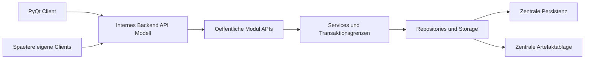

Status: verbindlicher Masterplan / Steuerungsdokument
Version: 0.1
Geltung: Roadmap und Arbeitspaket-Steuerung, keine Implementierungsspezifikation

# Master-Orchestration-Roadmap QMToolV7

## Leitplanken
- Keine Codeaenderungen, keine Refactorings, keine Dependency-Aenderungen und keine Implementierung in diesem Plan.
- Bestehende App bleibt waehrend aller Umbauten lauffaehig.
- Oeffentliche Python-Grenzen bleiben `modules/<name>/api.py` und `src/backend/api.py`.
- Backend ist Host/Transport-Adapter, kein Fachmodul und kein Ort fuer Businesslogik.
- GUI/CLI bleiben Adapter ohne fachliche Rollenentscheidungen, Repository-, SQL-, Storage- oder Datei-Direktzugriffe.

## Praezisierte SQLite-Invariante
- Fuer bereits backend-migrierte Use Cases darf SQLite nur noch vom Backend-Prozess geoeffnet werden.
- Noch nicht migrierte Legacy-Use-Cases duerfen bis zu ihrer Migration lokal bleiben.
- Ein Use Case darf nie halb lokal und halb backendseitig betrieben werden.
- Mehrere Clients duerfen nie direkt auf dieselbe SQLite-Datei zugreifen.
- PostgreSQL bleibt Zielrichtung/offene Entscheidung fuer echten Multiuser-Betrieb.

## Roadmap-Status
- Phase 0 `Backend-Basis / Healthcheck`: erledigt. Backend ist lokal startbar und `GET /health` wurde erfolgreich verifiziert.
- Phase 1 `Backend-Smoke-/Dependency-Stabilisierung`: erledigt bzw. nur noch optionaler Dokumentations-/Smoke-Gate-Nachtrag, falls spaeter ausdruecklich freigegeben.
- Naechster Schwerpunkt: keine Backend-Feature-Implementierung, sondern Boundary-, User/Auth-, UserContext-, Rollen- und Audit-Actor-Klaerung.

## Zielarchitektur

Entschieden:
- Modulzugriffe nur ueber `api.py`.
- Backend ruft fachliche Use Cases spaeter nur ueber oeffentliche Modul-APIs auf.
- Services bleiben fachliche Wahrheit fuer Autorisierung, Invarianten und Transaktionsgrenzen.
- Use-Case-Migration erfolgt komplett pro Use Case, nie halb lokal/halb backendseitig.

Offene Zielentscheidungen:
- internes Login oder externe Identitaet
- Token oder serverseitige Session
- UserContext- und Actor-Modell
- Rollenmodell, QMB-Semantik, Befugnisse/Kompetenzen
- Audit-Nachweisniveau und elektronische Signatur
- langfristige Backend-Transportart
- PostgreSQL-Zeitpunkt
- zentrale Artefaktablage
- Mehrmandantenfaehigkeit, Lizenzpruefung, Exportanforderungen

## MVP-Priorisierung
Zuerst stabilisieren:
- Dokumentenlenkung
- Lesebestaetigung / Kenntnisnahme
- Schulung, Kompetenz & Befugnisse
- Aufgaben- und Fristenmanagement
- Fehler / Abweichungen / CAPA light
- Audit-Export / Nachweispaket

Phase 2 nur beruecksichtigen, nicht vorziehen:
- Geraeteakte & Wartungsnachweise
- Qualitaetssicherung / Ringversuchsnachweise
- Material- & Chargenfreigabe light
- Managementbewertung / KPI-Uebersicht

## ADR-Paket-Regel
Alle ADR-Pakete sind reine Entscheidungs-/Dokumentationspakete:
- Keine Implementierung.
- Keine API-Aenderungen.
- Keine Migration.
- Keine Refactorings.
- Keine Dependencies.
- Keine bestehenden Dateien aendern, ausser eine ausdruecklich freigegebene ADR-/Planungsdatei.

## Erste 5 empfohlene Cursor-Arbeitspakete
1. `AP-002 Public-Boundary-Verstoesse inventarisieren`
   - Rein analytisch. Keine Umsetzung, keine Boundary-Cleanups.
   - Ziel: direkte externe Imports aus Modul-Internals klassifizieren.
   - Bereiche: `interfaces/*`, `tests/*`, `modules/*`.

2. `AP-003 User/Auth-Current-State-Map`
   - Rein analytisch. Keine Umsetzung.
   - Ziel: `current_user.json`, `get_current_user`, Rollen- und QMB-Verwendungen erfassen.
   - Bereiche: `modules/usermanagement`, CLI, PyQt, Training, Incident, Documents.

3. `AP-004 UserContext-ADR`
   - Entscheidungs-/Dokumentationspaket.
   - Ziel: UserContext, Actor, Session/Token und Request-Kontext klaeren.
   - Keine Implementierung, keine API-Aenderung, keine Migration.

4. `AP-005 Rollen-/QMB-Semantik-ADR`
   - Entscheidungs-/Dokumentationspaket.
   - Ziel: Admin/QMB/User, `is_qmb`, Modulrollen und spaetere Befugnisse abgrenzen.
   - Keine Implementierung, keine API-Aenderung, keine Migration.

5. `AP-006 Audit-Actor-ADR`
   - Entscheidungs-/Dokumentationspaket.
   - Ziel: Actor, Correlation, Causation und Audit-Nachweisniveau klaeren.
   - Keine Implementierung, keine API-Aenderung, keine Migration.

`AP-001 Backend-Smoke inventarisieren` bleibt im Backlog, ist aber nicht mehr unter den ersten fuenf empfohlenen Paketen, weil Backendstart und `GET /health` bereits erfolgreich verifiziert wurden.

## Wichtigste Risiken
- Globale Session-Datei und lokaler Current User als Actor-Quelle.
- Lokale `users.db` und lokale SQLite-Stores im Multiuser-Kontext.
- Verteilte Rechtepruefung und uneinheitliche QMB/Admin-Semantik.
- Lokale Artefaktablage und direkte Client-Dateipfade.
- Fehlendes durchgaengiges Optimistic Locking.
- Gefahr halb migrierter Use Cases.
- Backend koennte versehentlich Businesslogik oder Repository-Zugriffe aufnehmen.

## Bestehende Planungsartefakte
Aktive Grundlagen:
- `docs/DOCS_CANONICAL_INDEX.md`
- `docs/ARCHITECTURE_REFACTOR_CANONICAL.md`
- `docs/MODULE_INTEGRATION_POLICY.md`
- `docs/MODULES_DEVELOPER_GUIDE.md`
- `docs/TEST_SMOKE_GATES.md`
- `docs/OPERATIONS_CANONICAL.md`
- `docs/GUI_SOURCE_OF_TRUTH.md`
- `docs/GUI_ARCHITECTURE_PROJECT.md`
- `docs/LICENSE_SPEC.md`
- `docs/DOCUMENTS_ARCHITECTURE_CONTRACT.md`
- `docs/INCIDENT_MANAGEMENT_ARCHITECTURE_CONTRACT.md`

Historische oder zu klaerende Artefakte:
- `docs/SRP_REFACTOR_ROADMAP.md`: P2/History, spaeter archivieren vorschlagen.
- `docs/TRACK_B_SRP_PREP.md`: P2/History, spaeter archivieren vorschlagen.
- `docs/TRACK_B_CHANGE_SPEC.md`: P2/History, teils umgesetzt, spaeter archivieren oder als Historie belassen.
- `docs/CLI_FIRST_MIGRATION.md`: Legacy/History, nur erklaerend.
- `docs/UI_MVP.md`: Legacy/History, PyQt/P0 gewinnt.
- `docs/TAGESSTART.md`: internes historisches Log.
- `docs/RELEASE_READINESS.md`: P2/History, P0 Operations/Test Gates gewinnen.
- `docs/TRAINING_MODULE_SPEC.md`: fachlich relevant, aber Detailtiefe fuer Master-Roadmap nicht vorziehen; Status klaeren.

Konflikte markieren statt aendern:
- Alte P2-Dokumente koennen GUI-, Build- oder Migrationszustaende beschreiben, die P0 ueberholt hat.
- Hinweise auf direkte `contracts.py`-Nutzung stehen im Konflikt mit der geschaerften P0-Grenze `api.py`.
- Trainingsspezifikation enthaelt Detailarchitektur; fuer diese Roadmap nur Charter-/Priorisierungsebene nutzen.

## Naechste freigegebene Aktion
AP-002 Public-Boundary-Verstoesse inventarisieren.

## Nicht freigegeben
- Boundary-Cleanups
- Auth-Implementierung
- UserContext-Implementierung
- API-Aenderungen
- Backend-Feature-Routen
- Datenbank-/Artefaktmigration

## Hinweis zu AP-002
Ergebnis von AP-002 ist nur ein Inventar.
Aus AP-002 entstehende Cleanup-Arbeitspakete brauchen separate Freigabe.
