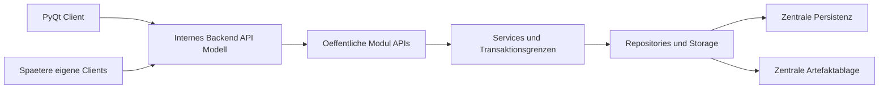

Status: verbindlicher Masterplan / Steuerungsdokument
Version: 0.1
Geltung: Roadmap und Arbeitspaket-Steuerung, keine Implementierungsspezifikation

# Master-Orchestration-Roadmap QMToolV7

## Leitplanken
- Keine Codeaenderungen, keine Refactorings, keine Dependency-Aenderungen und keine Implementierung in diesem Plan.
- Bestehende App bleibt waehrend aller Umbauten lauffaehig.
- Oeffentliche Python-Grenzen bleiben `modules/<name>/api.py` und `src/backend/api.py`.
- Backend ist Host/Transport-Adapter, kein Fachmodul und kein Ort fuer Businesslogik.
- GUI/CLI bleiben Adapter ohne fachliche Rollenentscheidungen, Repository-, SQL-, Storage- oder Datei-Direktzugriffe.

## Praezisierte SQLite-Invariante
- Fuer bereits backend-migrierte Use Cases darf SQLite nur noch vom Backend-Prozess geoeffnet werden.
- Noch nicht migrierte Legacy-Use-Cases duerfen bis zu ihrer Migration lokal bleiben.
- Ein Use Case darf nie halb lokal und halb backendseitig betrieben werden.
- Mehrere Clients duerfen nie direkt auf dieselbe SQLite-Datei zugreifen.
- PostgreSQL bleibt Zielrichtung/offene Entscheidung fuer echten Multiuser-Betrieb.

## Roadmap-Status
- Phase 0 `Backend-Basis / Healthcheck`: erledigt. Backend ist lokal startbar und `GET /health` wurde erfolgreich verifiziert.
- Phase 1 `Backend-Smoke-/Dependency-Stabilisierung`: erledigt bzw. nur noch optionaler Dokumentations-/Smoke-Gate-Nachtrag, falls spaeter ausdruecklich freigegeben.
- AP-002 Public-Boundary-Inventar: erledigt (Analyse/Inventar; Cleanup braucht separate Freigabe).
- ADR-/Analyse-Kette AP-003 bis AP-024: dokumentiert (Entscheidungen und Matrizen; keine Code-Implementierung in diesen Paketen).
- AP-025 Agent Guardrails und Repo-Konsistenz: erledigt (Governance/Docs/Gates; kein fachliches Produktverhalten).
- AP-026 Documents Review-ablehnen Evidence Baseline: erledigt (Test-Gate fuer bestehenden Servicefluss; Produktverhalten unveraendert; Kettenstatus bleibt `ketten-eingeschraenkt`).
- AP-027 Verbindliches Datenbank-Migrationsfundament: erledigt/gemergt in `main` (Commit-Grundlage `Establish AP-027 database migration foundation`); SQLite-Owner V1, forward-only Runner, Gates und Policy. PostgreSQL blieb bewusst ausserhalb AP-027.
- AP-028 Backend-gestuetztes Usermanagement mit serverseitigen Sessions: naechster freigegebener Schwerpunkt; Roadmap und Milestone-0-Prompt unter `docs/AP-028_USERMANAGEMENT_BACKEND_SESSIONS_ROADMAP.md` und `docs/AP-028_MILESTONE_0_PROMPT.md`. Umsetzung milestone-weise; kein Big-Bang.
- Nach Abschluss AP-028: Documents-Multiuser-MVP als separat freizugebendes Arbeitspaket (setzt bestaetigten UserContext/Sessions voraus).

## Zielarchitektur

Entschieden:
- Modulzugriffe nur ueber `api.py`.
- Backend ruft fachliche Use Cases spaeter nur ueber oeffentliche Modul-APIs auf.
- Services bleiben fachliche Wahrheit fuer Autorisierung, Invarianten und Transaktionsgrenzen.
- Use-Case-Migration erfolgt komplett pro Use Case, nie halb lokal/halb backendseitig.

Entschiedene Zielentscheidungen (AP-028 / Supervisor 2026-07-31):
- internes Login fuer dieses Arbeitspaket (kein externes IdP/SSO in AP-028)
- serverseitige opake Sessions als Erstmodell (kein JWT als Erstlösung)
- bestaetigter, serverseitig erzeugter UserContext als Identitaetsgrundlage fuer backend-migrierte Aufrufe
- Admin ist nicht automatisch QMB (AP-005 Option B angenommen)
- PostgreSQL-Zeitpunkt fuer den Scope Usermanagement: in AP-028 (Schema `usermanagement`); andere Module nicht Big-Bang

Offene Zielentscheidungen:
- Actor-/Audit-Nachweisniveau-Feinheiten und elektronische Signatur (Orientierung AP-006/006A; Umsetzung Auth-Audit in AP-028 M7)
- langfristige Backend-Transportart jenseits des internen FastAPI-Hosts
- PostgreSQL-Zeitpunkt fuer die übrigen Fachmodule
- zentrale Artefaktablage
- Mehrmandantenfaehigkeit, Lizenzpruefung, Exportanforderungen
- Befugnisse/Kompetenzen jenseits globaler Basisrollen/`is_qmb`
- Restpunkte in `docs/AP-028_USERMANAGEMENT_BACKEND_SESSIONS_ROADMAP.md` Abschnitt E (u. a. Passwortwechsel-Session-Policy, user_id-Remapping beim Cutover)

## MVP-Priorisierung
Zuerst stabilisieren:
- Dokumentenlenkung
- Lesebestaetigung / Kenntnisnahme
- Schulung, Kompetenz & Befugnisse
- Aufgaben- und Fristenmanagement
- Fehler / Abweichungen / CAPA light
- Audit-Export / Nachweispaket

Phase 2 nur beruecksichtigen, nicht vorziehen:
- Geraeteakte & Wartungsnachweise
- Qualitaetssicherung / Ringversuchsnachweise
- Material- & Chargenfreigabe light
- Managementbewertung / KPI-Uebersicht

## ADR-Paket-Regel
Alle ADR-Pakete sind reine Entscheidungs-/Dokumentationspakete:
- Keine Implementierung.
- Keine API-Aenderungen.
- Keine Migration.
- Keine Refactorings.
- Keine Dependencies.
- Keine bestehenden Dateien aendern, ausser eine ausdruecklich freigegebene ADR-/Planungsdatei.

## Erste 5 empfohlene Cursor-Arbeitspakete
1. `AP-002 Public-Boundary-Verstoesse inventarisieren`
   - Rein analytisch. Keine Umsetzung, keine Boundary-Cleanups.
   - Ziel: direkte externe Imports aus Modul-Internals klassifizieren.
   - Bereiche: `interfaces/*`, `tests/*`, `modules/*`.

2. `AP-003 User/Auth-Current-State-Map`
   - Rein analytisch. Keine Umsetzung.
   - Ziel: `current_user.json`, `get_current_user`, Rollen- und QMB-Verwendungen erfassen.
   - Bereiche: `modules/usermanagement`, CLI, PyQt, Training, Incident, Documents.

3. `AP-004 UserContext-ADR`
   - Entscheidungs-/Dokumentationspaket.
   - Ziel: UserContext, Actor, Session/Token und Request-Kontext klaeren.
   - Keine Implementierung, keine API-Aenderung, keine Migration.

4. `AP-005 Rollen-/QMB-Semantik-ADR`
   - Entscheidungs-/Dokumentationspaket.
   - Ziel: Admin/QMB/User, `is_qmb`, Modulrollen und spaetere Befugnisse abgrenzen.
   - Keine Implementierung, keine API-Aenderung, keine Migration.

5. `AP-006 Audit-Actor-ADR`
   - Entscheidungs-/Dokumentationspaket.
   - Ziel: Actor, Correlation, Causation und Audit-Nachweisniveau klaeren.
   - Keine Implementierung, keine API-Aenderung, keine Migration.

`AP-001 Backend-Smoke inventarisieren` bleibt im Backlog, ist aber nicht mehr unter den ersten fuenf empfohlenen Paketen, weil Backendstart und `GET /health` bereits erfolgreich verifiziert wurden.

## Wichtigste Risiken
- Globale Session-Datei und lokaler Current User als Actor-Quelle.
- Lokale `users.db` und lokale SQLite-Stores im Multiuser-Kontext.
- Verteilte Rechtepruefung und uneinheitliche QMB/Admin-Semantik.
- Lokale Artefaktablage und direkte Client-Dateipfade.
- Fehlendes durchgaengiges Optimistic Locking.
- Gefahr halb migrierter Use Cases.
- Backend koennte versehentlich Businesslogik oder Repository-Zugriffe aufnehmen.

## Bestehende Planungsartefakte
Aktive Grundlagen:
- `docs/DOCS_CANONICAL_INDEX.md`
- `docs/ARCHITECTURE_REFACTOR_CANONICAL.md`
- `docs/MODULE_INTEGRATION_POLICY.md`
- `docs/MODULES_DEVELOPER_GUIDE.md`
- `docs/TEST_SMOKE_GATES.md`
- `docs/OPERATIONS_CANONICAL.md`
- `docs/GUI_SOURCE_OF_TRUTH.md`
- `docs/GUI_ARCHITECTURE_PROJECT.md`
- `docs/LICENSE_SPEC.md`
- `docs/DOCUMENTS_ARCHITECTURE_CONTRACT.md`
- `docs/INCIDENT_MANAGEMENT_ARCHITECTURE_CONTRACT.md`

Historische oder zu klaerende Artefakte:
- `docs/SRP_REFACTOR_ROADMAP.md`: P2/History, spaeter archivieren vorschlagen.
- `docs/TRACK_B_SRP_PREP.md`: P2/History, spaeter archivieren vorschlagen.
- `docs/TRACK_B_CHANGE_SPEC.md`: P2/History, teils umgesetzt, spaeter archivieren oder als Historie belassen.
- `docs/CLI_FIRST_MIGRATION.md`: Legacy/History, nur erklaerend.
- `docs/UI_MVP.md`: Legacy/History, PyQt/P0 gewinnt.
- `docs/TAGESSTART.md`: internes historisches Log.
- `docs/RELEASE_READINESS.md`: P2/History, P0 Operations/Test Gates gewinnen.
- `docs/TRAINING_MODULE_SPEC.md`: fachlich relevant, aber Detailtiefe fuer Master-Roadmap nicht vorziehen; Status klaeren.

Konflikte markieren statt aendern:
- Alte P2-Dokumente koennen GUI-, Build- oder Migrationszustaende beschreiben, die P0 ueberholt hat.
- Hinweise auf direkte `contracts.py`-Nutzung stehen im Konflikt mit der geschaerften P0-Grenze `api.py`.
- Trainingsspezifikation enthaelt Detailarchitektur; fuer diese Roadmap nur Charter-/Priorisierungsebene nutzen.

## Naechste freigegebene Aktion
AP-028 ist die naechste freigegebene Aktion (Usermanagement Backend Sessions).

Planungsartefakte:
- `docs/AP-028_USERMANAGEMENT_BACKEND_SESSIONS_ROADMAP.md`
- `docs/AP-028_MILESTONE_0_PROMPT.md`

Umsetzung erfolgt streng milestone-weise (M0 Dokumentation → M1 Contracts → …
→ M9 Legacy-Grenze). Jeder Milestone braucht sein Test-Gate, bevor der naechste
beginnt. Documents-Multiuser-MVP bleibt danach separat freizugeben.

## Nicht freigegeben
- Boundary-Cleanups ausserhalb der in AP-028 explizit genannten Legacy-Grenzen
- RequestContext-/Kettenkontext-Vollimplementierung (AP-022) jenseits Request-ID am Auth-Rand von AP-028
- Command-ID-/Use-Case-ID-Implementierung
- Event-/Auditlog-Schemaaenderungen ausserhalb Usermanagement-Auth-Audit (AP-028 M7)
- Backend-Feature-Routen ausserhalb der AP-028 Auth-/Session-Endpunkte
- PostgreSQL-Migration anderer Fachmodule
- Fachliche Datenuebernahme oder Artefaktmigration ausserhalb Usermanagement-Cutover (AP-028 M8)
- Review-ablehnen Ketten-/Kontext-Upgrade (AP-026 ist nur Evidence-Baseline)
- Documents-Multiuser-MVP (erst nach AP-028, separate Freigabe)
- Incident-Modul Cleanup Admin=QMB (bekannte Abweichung; ausserhalb AP-028)

Im Rahmen von AP-028 freigegeben (milestone-weise):
- Auth-Implementierung (serverseitige Sessions)
- UserContext-Implementierung im Usermanagement-Scope
- API-Erweiterungen von `modules/usermanagement/api.py` laut Milestone-Plan
- Backend Auth-Routen (`/auth/*`) als Transport ohne Businesslogik
- PostgreSQL fuer Schema `usermanagement` inkl. Cutover-Vorbereitung

## Hinweis zu AP-002
Ergebnis von AP-002 ist nur ein Inventar und liegt vor.
Aus AP-002 entstehende Cleanup-Arbeitspakete brauchen weiterhin separate Freigabe.
