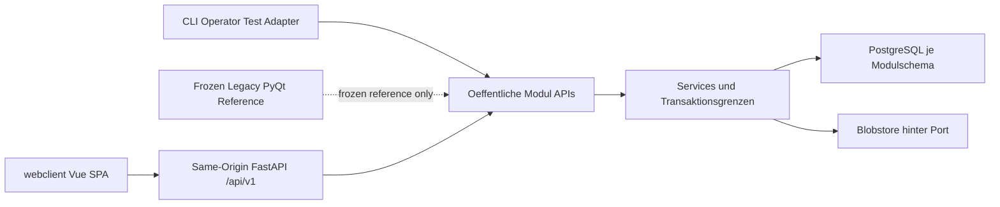

Status: verbindlicher Masterplan / Steuerungsdokument
Version: 0.2
Geltung: Roadmap und Arbeitspaket-Steuerung, keine Implementierungsspezifikation
Transition owner: `docs/AP-029_WEB_POSTGRES_TRANSITION_PLAN.md` (P1)

# Master-Orchestration-Roadmap QMToolV7

## Leitplanken
- Keine Codeaenderungen, keine Refactorings, keine Dependency-Aenderungen und keine Implementierung in diesem Plan.
- Oeffentliche Python-Grenzen bleiben `modules/<name>/api.py` und `src/backend/api.py`.
- Backend ist Host/Transport-Adapter, kein Fachmodul und kein Ort fuer Businesslogik.
- CLI bleibt Operator-/Testadapter ohne fachliche Rollenentscheidungen oder Repository-/SQL-/Storage-Direktzugriffe.
- Neue Endbenutzer-UI ist ausschliesslich `webclient/*` (nach WEB00). PyQt/Tk sind frozen Legacy/Reference.
- Produktive Persistenz ist PostgreSQL-only; kein produktiver SQLite-Fallback.

## Persistenz-Invariante (Ziel, DECIDED in AP-029)
- Produktive Runtime oeffnet ausschliesslich PostgreSQL.
- Eine PostgreSQL-Datenbank je Installation; Schema/Ownership/Migrationen je Modul.
- Keine direkten Cross-Schema-Abfragen zwischen Fachmodulen.
- SQLite nur fuer read-only Inventar, einmaligen Import und isolierte Tests.
- Historische Ist-SQLite-Stores bleiben bis zu INV00/PG01 inventarisiert und migriert; sie sind kein Zielbetrieb.

## Roadmap-Status
- Phase 0 `Backend-Basis / Healthcheck`: erledigt. Backend ist lokal startbar und `GET /health` wurde erfolgreich verifiziert.
- Phase 1 `Backend-Smoke-/Dependency-Stabilisierung`: erledigt bzw. nur noch optionaler Dokumentations-/Smoke-Gate-Nachtrag, falls spaeter ausdruecklich freigegeben.
- AP-002 Public-Boundary-Inventar: erledigt (Analyse/Inventar; Cleanup braucht separate Freigabe).
- ADR-/Analyse-Kette AP-003 bis AP-024: dokumentiert (Entscheidungen und Matrizen; keine Code-Implementierung in diesen Paketen).
- AP-025 Agent Guardrails und Repo-Konsistenz: erledigt (Governance/Docs/Gates; kein fachliches Produktverhalten).
- AP-026 Documents Review-ablehnen Evidence Baseline: erledigt (Test-Gate fuer bestehenden Servicefluss; Produktverhalten unveraendert; Kettenstatus bleibt `ketten-eingeschraenkt`).
- AP-027 Verbindliches Datenbank-Migrationsfundament: erledigt/gemergt in `main` (Commit-Grundlage `Establish AP-027 database migration foundation`); SQLite-Owner V1, forward-only Runner, Gates und Policy. PostgreSQL blieb bewusst ausserhalb AP-027.
- AP-028 Backend-gestuetztes Usermanagement mit serverseitigen Sessions: **Scope complete**
  (M0–M9; M8 Cutover-Prep in `main` als `0e25f9f` / PR #17; M9 Legacy-Grenze
  `docs/AP-028_M9_LEGACY_SESSION_BOUNDARY.md`). AP-028 scope-complete ist **nicht**
  gleichbedeutend mit „Gesamtrepo release-green“ (bekannter unabhaengiger Fehler
  `tests/e2e_cli/test_training_cli.py`). Produktiver PG-Cutover und UUID-Remapping
  der Quermodule bleiben ein separates Folgepaket ausserhalb AP-028.
- J04-M0: historische Documents-Transportmigration fuer den damaligen Desktop-Client
  (Documents, Artefakte, Signaturen). J04-M0 bleibt historisch Accepted und wird
  durch AP-029 nicht erneut geoeffnet.
- J04-M0 acceptance status: `Accepted` (formale menschliche Freigabe 2026-08-20;
  Produkt-Merge `e003b37`; aktuelle Main-Basis enthaelt die Acceptance-Historie).
  Word-COM-E2E und Produktionslizenz-/Deploymentpruefung bleiben optionale Folgepakete und
  sind kein Grund, den Acceptance-Status erneut auf `Rejected / follow-up required` zu setzen.
- **AP-029 / GOV00**: Zielarchitektur kanonisch festgeschrieben. GOV01/TOOL00 härten jetzt
  Ledger und autonomen Prüfablauf. Siehe Checkpoint-Ledger in
  `docs/AP-029_WEB_POSTGRES_TRANSITION_PLAN.md`.
- **J04-M1**: relationale fachliche Normalisierung erst **nach** Pilot (AP-029 Ledger);
  darf den Pilot nicht verzoegern.

## Zielarchitektur

Entschieden (AP-029 Entscheidungsregister D01–D14):
- Neue UI-Source-of-Truth: `webclient/` (Vue 3 + TypeScript + Vite; Vuetify hinter QM-Schicht).
- PyQt/Tk frozen; keine neue Produktentwicklung und kein Pilotbetrieb auf PyQt.
- Produktive Runtime PostgreSQL-only; kein SQLite-Fallback.
- Hosted-ready Single-Organisation; `organization_id` serverseitig.
- Same-Origin HTTPS, Cookie-Sessions, CSRF; `/api/v1` kanonische HTTP-Grenze.
- Zentrale SPA; Module liefern Datenvertraege/Capabilities/`allowed_actions`; keine Fachlogik im Browser.
- Append-only fachliches Audit in PostgreSQL; technische Logs separat.
- Blobstore mit gemeinsamen Backup-/Restore-Vertrag; keine Serverpfade im Browser.
- Erstes Deployment: Windows Server On-Prem, kontrollierte Releases, Restore statt Down-Migration.
- Backup ≠ Portabilitaetsexport ≠ Nachweisexport.
- Erster Pilot: begrenzter DMS-Kern PDF-first; keine QES-Behauptung.
- Container-Prototyp nur portabler Kern; keine J04-Bootstrap-Regression; Produktivierung spaeter.
- Gated Makros dürfen mehrere Checkpoints nur seriell mit separater Allowlist, Evidence,
  Reviewer-Verdict und lokalem Commit orchestrieren; höchstens zwei normale Reworks je Checkpoint
  und danach genau ein Escalation Review.
- Container wird vor Übernahme qualifiziert; CB00 kann als dokumentierter No-Code-PASS enden.

Entschiedene Zielentscheidungen (AP-028 / Supervisor 2026-07-31; weiter gueltig wo nicht durch AP-029 ersetzt):
- internes Login fuer AP-028-Scope (kein externes IdP/SSO in AP-028)
- serverseitige opake Sessions als Erstmodell (kein JWT als Erstlösung)
- bestaetigter, serverseitig erzeugter UserContext als Identitaetsgrundlage fuer backend-migrierte Aufrufe
- Admin ist nicht automatisch QMB (AP-005 Option B angenommen)
- PostgreSQL fuer Schema `usermanagement` in AP-028 vorbereitet; flächendeckender Produkt-Cutover folgt AP-029 Ledger

Offene Feinheiten (nicht erneut als Architektur-Grundsatzentscheidungen):
- Actor-/Audit-Nachweisniveau-Feinheiten und elektronische Signatur jenseits des bestehenden QM-Signaturpfads
- Converter-Auswahl/Haertung (CONV00)
- Befugnisse/Kompetenzen jenseits globaler Basisrollen/`is_qmb`
- Restpunkte in `docs/AP-028_USERMANAGEMENT_BACKEND_SESSIONS_ROADMAP.md` Abschnitt E
  (user_id-Remapping: separates Folgepaket)

## AP-029 Checkpoint-Reihenfolge (verbindlich)

GOV00 → GOV01 → TOOL00 → CB00 → INV00 → PG00 → WEB00 → PG01 → UX00 → OPS00 → WCON00 → INT00 → WEB01 → PILOT00 → PILOT01 → CB01 → CONV00 → J04-M1 → MOD00

Nach erfolgreichem GOV00 ist die **naechste autorisierte Aktion ausschliesslich GOV01** als Teil
des ausdrücklich freigegebenen Makros M0 (GOV01 → TOOL00). Produktcheckpoints beginnen erst nach
Integration dieser Governance-/Tooling-Basis in `origin/main`.

Ein ausdrücklich freigegebenes Makro darf seine benannten Checkpoints seriell ohne weitere
Nutzerinteraktion abarbeiten. Jeder Checkpoint behält eigenen Diff, Evidence, Review und lokalen
Commit; das Makro stoppt beim ersten unresolved Checkpoint. Destruktive Läufe, Human Gates,
Push/PR/Merge, Deployment und Echtdaten bleiben separat freizugeben.

## MVP-Priorisierung
Zuerst stabilisieren (Pilot-Kern laut AP-029):
- Dokumentenlenkung (Web/PostgreSQL)
- Signatur / PDF-Viewer / Freigabe / Audit
- minimale Nutzerverwaltung und serverseitige `allowed_actions`

Danach:
- Lesebestaetigung / Kenntnisnahme
- Schulung, Kompetenz & Befugnisse
- Aufgaben- und Fristenmanagement
- Fehler / Abweichungen / CAPA light
- Audit-Export / Nachweispaket

Phase 2 nur beruecksichtigen, nicht vorziehen:
- Geraeteakte & Wartungsnachweise
- Qualitaetssicherung / Ringversuchsnachweise
- Material- & Chargenfreigabe light
- Managementbewertung / KPI-Uebersicht

## ADR-Paket-Regel
Alle ADR-Pakete sind reine Entscheidungs-/Dokumentationspakete:
- Keine Implementierung.
- Keine API-Aenderungen.
- Keine Migration.
- Keine Refactorings.
- Keine Dependencies.
- Keine bestehenden Dateien aendern, ausser eine ausdruecklich freigegebene ADR-/Planungsdatei.

## Historische Cursor-Arbeitspakete (AP-002 … AP-006)
Die frueheren „erste 5“ ADR-/Analyse-Pakete sind abgeschlossen bzw. dokumentiert und dienen
nur noch als Historie. Aktive Steuerung erfolgt ueber AP-029.

## Wichtigste Risiken
Siehe Risikoregister in `docs/AP-029_WEB_POSTGRES_TRANSITION_PLAN.md` (R01–R22), u. a.:
- parallele PyQt-/Web-Fachlogik
- produktiver SQLite-Fallback
- Browser-Token-Leak / CSRF / clientgelieferte Identitaeten
- Cross-Schema-SQL und Modulkopplung
- DB-/Blob-Inkonsistenz und Migration ohne Ownership/Lock/Fingerprint
- falsche PASS-Aussagen fuer nur geplante Faehigkeiten
- Container-Prototyp ueberschreibt J04-Bootstrap

## Bestehende Planungsartefakte
Aktive Grundlagen:
- `docs/AP-029_WEB_POSTGRES_TRANSITION_PLAN.md`
- `docs/DOCS_CANONICAL_INDEX.md`
- `docs/WEBCLIENT_UX_SPECIFICATION.md`
- `docs/WEBCLIENT_UX_CONTRACT_GAP_MATRIX.md`
- `docs/ARCHITECTURE_REFACTOR_CANONICAL.md`
- `docs/MODULE_INTEGRATION_POLICY.md`
- `docs/MODULES_DEVELOPER_GUIDE.md`
- `docs/TEST_SMOKE_GATES.md`
- `docs/OPERATIONS_CANONICAL.md`
- `docs/DATABASE_EVOLUTION_POLICY.md`
- `docs/GUI_SOURCE_OF_TRUTH.md`
- `docs/GUI_ARCHITECTURE_PROJECT.md`
- `docs/LICENSE_SPEC.md`
- `docs/DOCUMENTS_ARCHITECTURE_CONTRACT.md`
- `docs/INCIDENT_MANAGEMENT_ARCHITECTURE_CONTRACT.md`

JSON-Persistenz-Baseline und J-Pakete bleiben historische/parallele Planungsartefakte;
J04-M1 ist im AP-029-Ledger nach dem Pilot eingeordnet.

Historische oder zu klaerende Artefakte:
- `docs/SRP_REFACTOR_ROADMAP.md`: P2/History
- `docs/TRACK_B_SRP_PREP.md`: P2/History
- `docs/TRACK_B_CHANGE_SPEC.md`: P2/History
- `docs/CLI_FIRST_MIGRATION.md`: Legacy/History
- `docs/UI_MVP.md`: Legacy/History
- `docs/PYQT_CONTRIBUTIONS_REFERENCE.md`: P2 Legacy/History (frozen inventory)
- `docs/TAGESSTART.md`: internes historisches Log
- `docs/RELEASE_READINESS.md`: P2/History, P0 Operations/Test Gates gewinnen

## Naechste freigegebene Aktion
Die naechste freizugebende Aktion ist ausschliesslich OPS00
(Windows service, HTTPS, backup/restore, export; TODO, vorbereitet,
nicht gestartet — erfordert explizite Freigabe).
**PG01** ist `PASS`; PR #39 wurde per Squash nach `main` @
`58caddac224ab46ed63392fba92fc11b94e9ddf2` gemergt. **UX00 ist PASS** auf
`feature/ap-029-ux00`; kanonische P0-UX und P1-Gap-Matrix liegen vor. OPS00 ist nicht gestartet.
WCON00, INT00 und spaetere Checkpoints sind nicht freigegeben.
**WEB00 PASS** (lokal `da9db323…` auf `feature/ap-029-web00`). **PG00 PASS** (gemergt `8a67f67`, PR #32). INV00 ist PASS (`90cefa4`).
M0-EV01 (verspäteter GOV01-R5-Reviewer `e5b22ec9-4fb5-4357-969b-b8df6552eee4`) ist
reconciliert als non-authoritative / superseded PASS auf Fingerprint `3244c87f…`;
autoritativ bleibt R5 `r5-20260821T133945364Z` / Agent `5e997705…`. Die Gate-Überlappung
ist als Prozessabweichung dokumentiert und ändert den Checkpoint-Status nicht.

Planungsartefakte (AP-028, historisch/abgeschlossen):
- `docs/AP-028_USERMANAGEMENT_BACKEND_SESSIONS_ROADMAP.md`
- `docs/AP-028_MILESTONE_0_PROMPT.md`
- `docs/AP-028_M0_STATE_MATRIX.md`
- `docs/AP-028_M8_CUTOVER_PREP.md`
- `docs/AP-028_M9_LEGACY_SESSION_BOUNDARY.md`

J04-M0 Historie (Accepted; unveraendert):
- `docs/J04_M0_ACCEPTANCE_REPORT.md`
- `docs/J04_M0_EXECUTABLE_CHECKLIST.md`
- `docs/J04_M0_PATH_MATRIX.md`

## Nicht freigegeben
- PG00 und alle spaeteren AP-029-Produktcheckpoints ohne expliziten Makroauftrag und
  veröffentlichte Governance-/Tooling-Basis
- Neue PyQt-Produktarbeit oder PyQt-Pilotbetrieb
- Produktiver SQLite-Fallback
- Boundary-Cleanups ausserhalb explizit genannter Legacy-Grenzen
- RequestContext-/Kettenkontext-Vollimplementierung (AP-022) jenseits bestehender Auth-Raender
- Command-ID-/Use-Case-ID-Implementierung
- Fachliche Datenuebernahme / UUID-Remapping der Quermodule ohne eigenes Paket
- Training-CLI-Reparatur (`tests/e2e_cli/test_training_cli.py`)
- Review-ablehnen Ketten-/Kontext-Upgrade (AP-026 ist nur Evidence-Baseline)
- J04-M1 relationale Workflowinstanzen vor Pilotabschluss
- Incident-Modul Cleanup Admin=QMB (bekannte Abweichung)
- Container-Produktivierung vor Web-/PostgreSQL-Fundament
- Formale neue Acceptance / Deployment / Echtdaten-Pilot ohne PILOT00/PILOT01

## Hinweis zu AP-002
Ergebnis von AP-002 ist nur ein Inventar und liegt vor.
Aus AP-002 entstehende Cleanup-Arbeitspakete brauchen weiterhin separate Freigabe.
